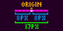
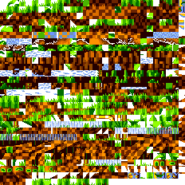
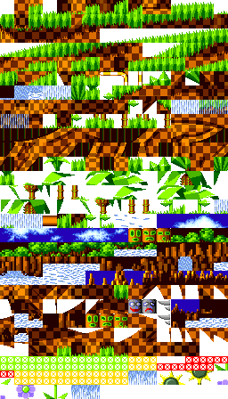
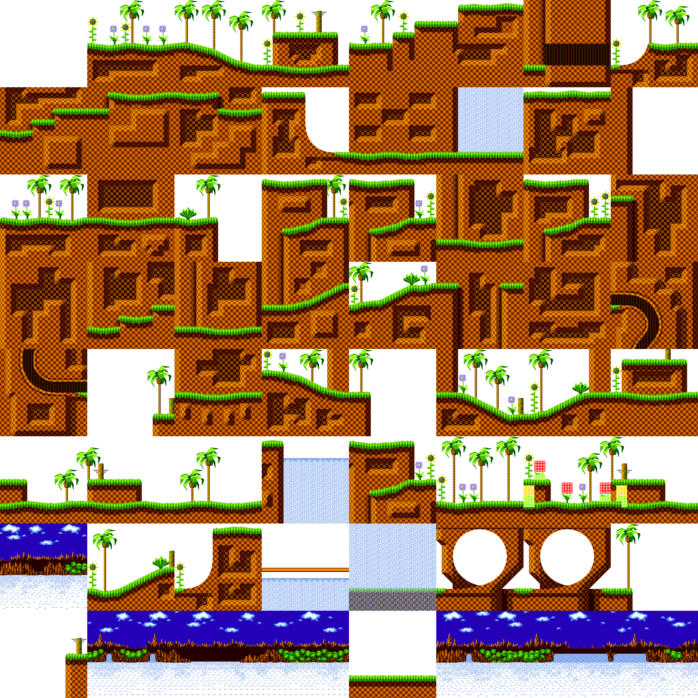
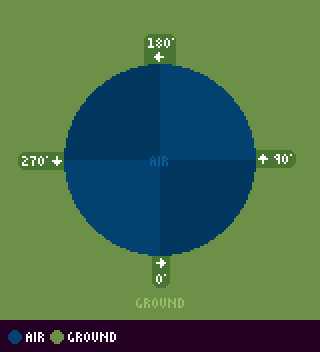

# Basics: Objects, Maps, Subpixels, Angles, and Framerates

> **Source:** [SPG:Basics](https://info.sonicretro.org/SPG%3ABasics)

[← Sonic Physics Guide: Overview](00-overview.md) | [Index](../README.md) | [Calculations: Angle Ranges & Trigonometric Functions →](02-calculations.md)

---

The aim of the guide is to describe the mechanics of classic Sonic games accurately, while explaining the concepts well enough to allow for flexible implementation. While there are many different ways to achieve the same or similar results, nothing has to be recreated the exact way the Genesis hardware did.

Before we delve into how the games work, it's important to know some key concepts that will apply to multiple aspects throughout this guide. Most of this is relevant for extremely close accuracy, and provides context for some of the game's more subtle behavior.

> [!NOTE]
> Coordinate systems start from left to right, and up to down.

## Hexadecimal

Hexadecimal (abbreviated to hex) occurs from time to time throughout the guide, instead of going from 0-9 like in decimal, you go from 0-F (0-15). Hex values will either have a *"0x"* at the beginning or *"H"* at the end to indicate that it's hex rather than decimal.

## Types and Formats

These data types and formats will be used throughout the guide.

| Format | Specifier |
| --- | --- |
| Variable | ***Variable Name*** |
| Constant | **constant_name** |
| Values | *123* |
| (Sub)pixel | 456(sub)px |
| Screen Value | *Decimal (px, subpx)* |
| Position | (X Position, Y Position) |
| Angles | *Degree Conversion° (Hex Angle)* |
| Flag | A value that is either true or false (1 or 0). |
| Byte | A value that can only range from 0 to 255 (0x00 to 0xFF). |

## Objects

Objects are the moving building blocks of every game (aside from the Terrain or [Solid Tiles](04-terrain-collision.md) which physically make up the Zones and Acts themselves). [Characters](03-characters.md), [Badniks](14-game-enemies.md#badniks), [Springs](13-game-objects.md#springs) and so on, are objects. [Bosses](14-game-enemies.md#bosses) are constructed from multiple objects.

### Variables

The following object variables/constants will be referenced frequently in this guide.

| Variable | Description |
| --- | --- |
| ***X Position (X)*** | The X-coordinate of the object's center. |
| ***Y Position (Y)*** | The Y-coordinate of the object's center. |
| ***X Speed*** | Speed along the X-axis. |
| ***Y Speed*** | Speed along the Y-axis. |
| ***Ground Angle (GAngle)*** | The object's angle, or angle on the ground. |
| ***Ground Speed (GSpeed)*** | Speed along the ***Ground Angle***. |
| ***Horizontal/Width Radius*** | The object's width from its origin pixel, left to right. |
| ***Vertical/Height Radius*** | The object's height from its origin pixel, up to down. |

> [!NOTE]
> *This applies to the Player and some other objects. Some objects don't need variables such as Ground Speed if they don't move, or even collide with terrain.*

### Sizes

Objects use a ***Width and Height Radius*** to define their size for collision, which is used to define a box radius around it. A minimum size the box can be is *1x1px* with *0x0px* ***Width and Height Radius***. A box with *2x4px* ***Width and Height Radius*** has a size of *5x9px*.

### Hitboxes

[Hitboxes](07-hitboxes.md) is an area where the Player can detect other objects. With *most* objects can have a hitbox.
Not to be confused with ***Width and Height Radius***, while they do follow the same format, they serve two different purposes to the object. For example, a ring's ***Width/Height Radius*** would be *8*, but for it's hitbox it is *6*.

## Level Maps

This is the main body of every level, and is what the objects traverse on during gameplay. In the original games, the levels are split into different grids.
**Note:** *#x* means it has both a width and height of **#**.

| Term | Description | Example |
| --- | --- | --- |
| ***[Cell](https://info.sonicretro.org/Cell) (8x)*** | A 8x grid of pixels. |  |
| ***Block (16x)*** | A 2x grid of cells. In [Sonic Mania](https://info.sonicretro.org/Sonic_Mania), it's a 16x grid of pixels instead. |  |
| ***Metablock (128x/256x)*** | A 16x (Sonic 1/CD), or 8x (in the games following) grid of blocks. |  |

In the original games, the data for the level layout would be *indexes* of **Metablocks**, in which that would contain *indexes and horizontal/vertical flips* of its **Blocks**, in which those would contain *indexes, horizontal/vertical flips, and palette index* for it's **Cells**. In [Sonic Mania](https://info.sonicretro.org/Sonic_Mania), the data for the level layout is just indexes *indexes and horizontal/vertical flips* for **Blocks**, which is the modern approach for implementation.

## Subpixels

In the original games, Subpixels are used for position and speed to have a value smaller than a whole pixel. Subpixels have a range from *0-255* before passing over into a whole pixel. A modern approach would be to use floating point values, but for more info on how they work in the original games, see [Pixel and Subpixel](02-calculations.md#pixel_and_subpixel).

> [!IMPORTANT]
> Collision typically happen at the **whole pixel level**, ignoring subpixels. When you perform collision calculations, make sure to disregard the subpixel value when doing so.

*Subpixels displayed as whole pixels on an image.*

## Angles

Throughout this guide, degree angles are counter-clockwise (*0°* facing right, *180°* facing left). Like positions and speeds, angles are also formatted differently in the original game. These will be called Hex angles (0 to 255, instead of 0 to 360). It's fine to use normal 360 degree angle values when using a modern game engine, however for more info on how they actually work in the original game, see [Hex Angles](02-calculations.md#hex_angles).

## Framerates

Speed and acceleration is added per frame. To figure out the speed in units per second, it's necessary to know the framerate the games run at, in frames per second (FPS). The original releases were intended to run at *60Hz (NTSC)* (*50Hz PAL/SECAM* versions run slower), so assume *60* FPS for speeds given in this guide.

If **acceleration_speed** was *0.046875 (12 subpixels)* per frame, to find the value per second you need to multiply that by *60*, resulting in *2.8125 (720 subpixels)*. This can be converted into any framerate by multiplying by Δ (seconds per frame, or 1/framerate). If your game will always run at *60* FPS, then you can ignore this.

---

[← Sonic Physics Guide: Overview](00-overview.md) | [Index](../README.md) | [Calculations: Angle Ranges & Trigonometric Functions →](02-calculations.md)
