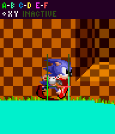
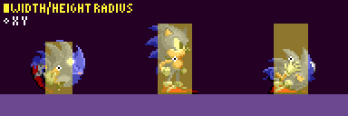
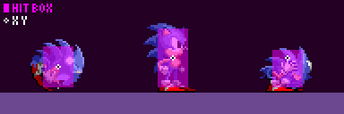
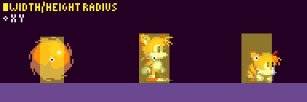
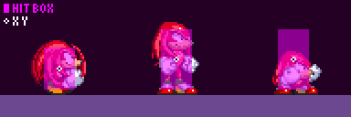
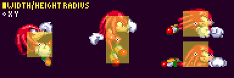

# Characters: Sonic, Tails, and Knuckles Physics Differences

> **Source:** [SPG:Characters](https://info.sonicretro.org/SPG%3ACharacters)

[← Calculations: Angle Ranges & Trigonometric Functions](02-calculations.md) | [Index](../README.md) | [Terrain Collision: Solid Tiles, Block Data, and Sensors →](04-terrain-collision.md)

---

**Characters** are [objects](01-basics.md#objects) (referred to as the "Player (objects)", in the guide), with each character having their own size, constants, and movesets. Size determines how they collide with [Solid Tiles](04-terrain-collision.md) and [Solid Objects](08-solid-objects.md). [Hitboxes](07-hitboxes.md) determine how they react with [game objects](13-game-objects.md) in general. For character specific moves, see [Special Abilities](16-special-abilities.md).

Unless stated, the following attributes are same across all characters.

| Constants/Variables | Values |
| --- | --- |
| ***Push Radius*** | 10 |
| ***Width Radius*** | *9 (19 wide)* |
| ***Height Radius*** | *19 (39 pixels tall)* |
| ***Width Radius (Rolling)*** | *7 (15 pixels wide)* |
| ***Height Radius (Rolling)*** | *14 (29 pixels tall)* |
| ***Height Radius (Hitbox)*** | ***Height Radius*** - 3 (6 shorter) |
| ***Hitbox Width Radius*** | *8 (17 pixels wide)* |
| ***jump_force*** | 6.5 (6 pixels and 128 subpixels) |

| Change in Width Radius |
| --- |
|  |

 

| Sonic the Hedgehog |
| --- |
|  |
| ***Hitbox Height Radius (Crouching):*** *10* |
|  |
| When crouching as *Sonic only*, *12* pixels is added to the hitbox's Y position to put it near the ground. In **Sonic 3** and onwards, crouching does not affect Sonic's hitbox. |

| Miles "Tails" Prower |
| --- |
|  |
| ***Height Radius:*** *15 (31 pixels tall)*.  [Flying](16-special-abilities.md#flying) has the same size as standing. |

| Knuckles the Echidna |
| --- |
|  |
| ***jump_force:*** *6* |
| Knuckles (Gliding/Climbing) |
|  |
| ***Width Radius:*** *10 (21 pixels tall)*   ***Height Radius:*** *10 (21 pixels tall)*   [Falling](16-special-abilities.md#falling) has the same size as standing. |

---

[← Calculations: Angle Ranges & Trigonometric Functions](02-calculations.md) | [Index](../README.md) | [Terrain Collision: Solid Tiles, Block Data, and Sensors →](04-terrain-collision.md)
