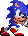
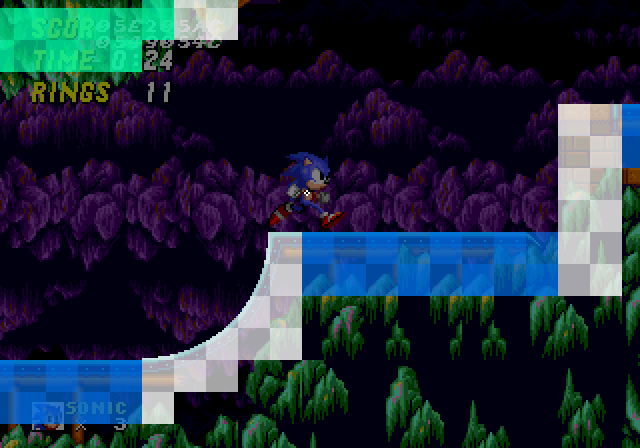
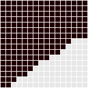
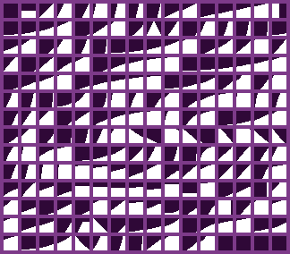
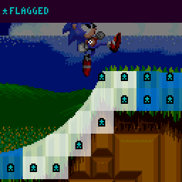
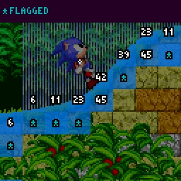
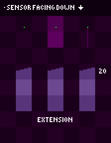

# Terrain Collision: Solid Tiles, Block Data, and Sensors

> **Source:** [SPG:Solid Tiles](https://info.sonicretro.org/SPG%3ASolid_Tiles)

[← Characters: Sonic, Tails, and Knuckles Physics Differences](03-characters.md) | [Index](../README.md) | [Terrain Interaction: Collision Layers and Loop Physics →](05-terrain-interaction.md)

---

 

 

|  | **It has been proposed that *SPG:Solid Tiles* be renamed and moved to *SPG:Terrain Collision*.** Reason for proposal: Naming scheme and structure has been significantly altered on this page. |
| --- | --- |

## Block Data

The data for each **Block** contains an index to an item in the **Height Array**, this index also for the item in an **Angle Array**. Inside a **Metablock**, **Blocks** can be set to 4 different types of solidity.

| **Color** | **Usage** |
| --- | --- |
| ⬤ | Detectable by all sensors. |
| ⬤ | Only detectable by downward facing sensors. |
| ⬤ | Not detectable by downward facing sensors. |
|  |  |

### Height Array

Each **Height Array** contains *16* values, ranging from *-16* to *16*. when the value is above zero, it means how far we are away from the *bottom*, when it's negative it means how far we are away from the *top*. An array going *right* and *left* instead of *up* and *down* also exists, but this could be [calculated automatically](https://github.com/sonicretro/s1disasm/blob/c8278dc0429f38c5938699104ac0bbd3c710fa86/sonic.asm#L6276).

| Property | Value |
| --- | --- |
| **Vertical Height Array** | [0, 0, 1, 2, 2, 3, 4, 5, 5, 6, 6, 7, 8, 9, 9, 9] |
| **Horizontal Height Array** | [0, 0, 0, 0, 0, 0, 0, 3, 4, 5, 7, 9, 10, 11, 13, 14] |
| Angle | 33.75° *(232)* |

Example **Height Array**

|  |
| --- |
| Example of different height arrays to account for possible slopes. |

### Flagged Angles

A *360° (255)* **Angle** is used as a flag to notify an object to use its own angle to the nearest *90° (128)* instead. This is most commonly used with full **Blocks** and ramp edges.

| **Flagged Tiles** |  |
| --- | --- |
|  |  |
| Flagged tiles have an angle of *360° (255)*. |  |

## Sensors

Sensors are checks performed by objects to look for Solid **Blocks** around them. Sensors can point down, right, up, or left similar to the **Height Array**, and all sensors behave the same in every direction.

First, the **Height Array** value is found in the **Block** at the initial ***X/Y Position* (Anchor)** of the sensor. If it's zero, check the **Block** ahead *(Extension)*, if it's full or going in the same direction as the sensor, check the **Block** behind *(Regression)*. This process returns the distance, the *Block* ID and angle. With this in mind, a Sensor can always locate the nearest open surface within a range of *2* Blocks (including tile data).

| **Visualization** |
| --- |
|  |

### Range

If the distance is between 16 and 32 (inclusive, to the end of the 2nd **Block**), it will be treated as if no **Block** was found. If a distance of 0 touches the surface, the object doesn't need to move (may still choose to collide). Negative distances are used to get out of terrain, only add positive distances if you are snapping onto terrain.

### Usage

Usually, objects align their sensors with their ***Width/Height Radius*** by adding those values to the object's current ***X/Y Position***. Most objects use 1 or 2 Sensors pointing down to the floor, some use  more to check for walls. The Player object is more complex and can sometimes use up to 5 Sensors at once depending on their state. How the Player uses Sensors is described in [Slope Collision](06-slope-collision.md#the_player27s_sensors).

### Distance Rejection

Objects will reject distances too far in either direction. Objects only check returned distances it accepts for collision. Usually, if an object sees it's outside *-13* to *13*, it doesn't collide, this also filters out the "no **Block** found" distances.

## Notes

- *The following only outlines Sensor -> **Block** interaction. For solid objects, see: [Solid Objects](08-solid-objects.md)*.
- *For player specific collision and movement, see: [Slope Collision](06-slope-collision.md) (Part 1)*.

---

[← Characters: Sonic, Tails, and Knuckles Physics Differences](03-characters.md) | [Index](../README.md) | [Terrain Interaction: Collision Layers and Loop Physics →](05-terrain-interaction.md)
