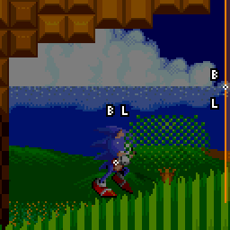
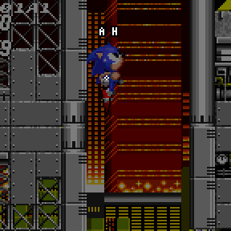
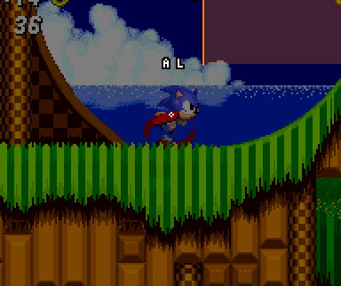
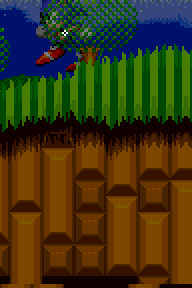
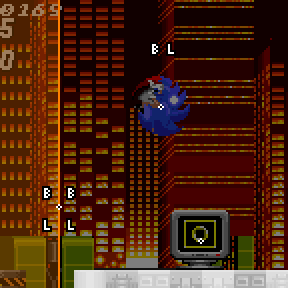
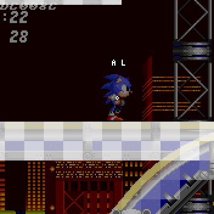

# Terrain Interaction: Collision Layers and Loop Physics

> **Source:** [SPG:Solid Terrain](https://info.sonicretro.org/SPG%3ASolid_Terrain)

[← Terrain Collision: Solid Tiles, Block Data, and Sensors](04-terrain-collision.md) | [Index](../README.md) | [Slope Collision: Sensors, Grounded, 360°, and Airborne →](06-slope-collision.md)

---

When you run through loops [Sonic 1](https://info.sonicretro.org/Sonic_1)/[Sonic CD](https://info.sonicretro.org/Sonic_CD), special code is run to switch out the **Metablock** ID with a copy containing different solidity mappings. In [Sonic 2](https://info.sonicretro.org/Sonic_2) and onwards, there are 2 different **Layers** for collision, with 2 solidity type lists stored in **Metablocks**. This layer system allows for more complex layering besides loops.

### Layer Switchers

An [Object](01-basics.md#objects) is used to switch between these two layers, and can be represented as a horizontal/vertical line. When the ***Player's X and Y Position*** crosses through the line, both the **Player's Layer** (**A** and **B**) and **[Priority Flag](01-basics.md#object_priority)** *(**L** and **H**)* will be set to the values for that side of the line. A Switcher an have a ***Radius*** of *32, 64, 128 or 256 pixels*.

| **Orientation** | Rule |
| --- | --- |
| **Vertical** | **Player Y Position** has to be between the Switcher `Y Position +/- Radius`. |
| **Horizontal** | **Player X Position** has to be between the Switcher `X Position +/- Radius`. |
| **Flags** | Definition |
| **Grounded Only** | Switch only when the player passes through while **Grounded**. |
| **Priority Only** | Switch priority only. |

| **Horizontal Switcher** | **Vertical Switcher** |
| --- | --- |
|  |  |

Once all off the above criteria matches, the **Layer/Player Priority Flag** will update when the Player's current side is different from the **Side Flag**, its value is always updated after, regardless if the criteria was actually met.

| **Loops** |
| --- |
|  |
| Sonic's layer changes via the switcher (*Grounded Only* mode set) mid loop. The switcher after the loop sets it back to A. |

| **Side Flag** |
| --- |
|  |
| *holds which side the player is currently on.* |

 

| **Wave Paths** | **Zig-Zag Paths** |
| --- | --- |
|  |  |
| Switchers swap Sonic's **Priority Only** to weave the sprite in and out of graphics. |  |

---

[← Terrain Collision: Solid Tiles, Block Data, and Sensors](04-terrain-collision.md) | [Index](../README.md) | [Slope Collision: Sensors, Grounded, 360°, and Airborne →](06-slope-collision.md)
