# Slope Collision: Sensors, Grounded, 360°, and Airborne

> **Source:** [SPG:Slope Collision](https://info.sonicretro.org/SPG%3ASlope_Collision)

[← Terrain Interaction: Collision Layers and Loop Physics](05-terrain-interaction.md) | [Index](../README.md) | [Hitboxes: Player Hitbox and Trigger Areas →](07-hitboxes.md)

---

The Player has a larger set of [Sensors](04-terrain-collision.md#sensors) than most other objects.

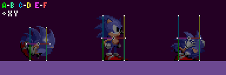

| Sensor | Purpose | Relative Offset |
| --- | --- | --- |
| **A** & B | Ground | (**Width Radius**, **Height Radius**) |
| **C** & D | Ceiling | (**Width Radius**, 0 - **Height Radius**) |
| **E** & F | Walls | (**Push Radius**, 0) |

White points represent Sensors positions.

**Note:** X values are inverted for each **1st** Sensor.

The Player sprite appears *1px* further inside a **Block** when facing left. This does not occur with most objects due to their hitboxes having a (1, -1) **X & Y Offset**. More about object collision in [Solid Objects](08-solid-objects.md).

> [!NOTE]
> Angles found by all sensors take [**flagged Blocks**](06-slope-collision.md#angles_of_flagged_tiles) into account.

## Grounded

The **Ceiling Sensors** aren't active while grounded. The **Push Sensor** the Player is moves towards will be active, but when ***Ground Speed*** is zero or the ***Ground Angle*** isn't between *-90°* to *90°* inclusive, neither will be checked.

> [!NOTE]
> In S3K, Push Sensors will be active when the Player's ***Ground Angle*** is a multiple of *90° (64)*.

| 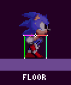 | 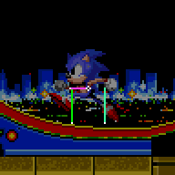 |
| --- | --- |
| The **4** modes for collision, each having altered code, **Ground Angle** determines which to use. | If we only ever used the **Floor** mode, it would be more akin to regular platformers. |

Determining The Mode

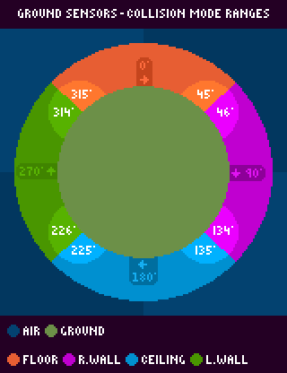

| Mode | Range | Range (Wall) | Real Offset |
| --- | --- | --- | --- |
| Floor | *315° (224)* - *45° (32)* | *316° (223)* - *44° (31)* | (X, Y) |
| Right Wall | *46° (33)* - *134° (95)* | *45° (32)* - *135° (96)* | (Y, -X) |
| Ceiling | *135° (96)* - *225° (160)* | *136° (97)* - *224° (159)* | (X, -Y) |
| Left Wall | *226° (161)* - *314° (223)* | *225° (160)* - *315° (224)* | (-Y, X) |

**Note:** Push Sensors have larger Wall ranges.

| 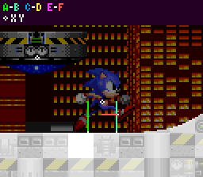 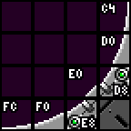 |
| --- |
| Sonic's position shifts when mode change occurs, his Push Sensor changes mode first due to it's different angle range. |
| 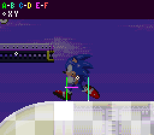 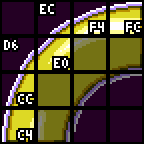 |
| Sonic's mode switches erratically on the curve, due to his ***Ground Angle*** decreasing when switching to Wall mode, the faster you move the less noticeable it becomes. |

| **Ground Sensors** |  |
| --- | --- |
| 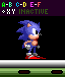 | 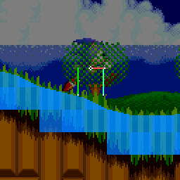 |
| **Ground Sensors** at the Player's feet. | **Ground Sensors** while moving. |

Both Sensors search for a Solid **Block**, with the lesser distanced sensor being used. If both distances are the same, Sensor **A** has priority. In *[Sonic 1](https://info.sonicretro.org/Sonic_1)*, if distance isn't between *-14* to *14* inclusive, the Player won't collide. In *[Sonic 2](https://info.sonicretro.org/Sonic_2)* onwards, it's between *-14* to `min(abs(X Speed) + 4, 14)`, the faster the Player moves, the greater the distance can be. Distance offsets the Player out of the ground, and ***Ground Angle*** will be used from the winning sensor's **Block**.

| **Edge Balancing** |  |  |
| --- | --- | --- |
| **X Position** from the edge |  |  |
| 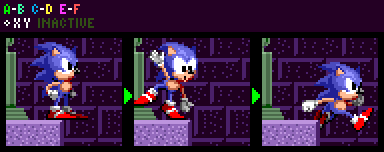 |  |  |
| -1px | 0px | 10px |

When **Ground Speed** is *0*, and only a single **Block** was found, an extra sensor checks at the Player's ***X and `Y Position + Height Radius`*** for one. If none's found then the balancing animation plays. In *[Sonic 2](https://info.sonicretro.org/Sonic_2)* onwards, if the Player is 6px away from a ledge, an alternate animation will play.

> [!NOTE]
> While balancing, the Player can't duck, look up, Spindash, etc. In *[Sonic 3](https://info.sonicretro.org/Sonic_3) [& Knuckles](https://info.sonicretro.org/%26_Knuckles)*, the Player can duck and Spindash (not to look up) when balancing on the ground but not on an object.

| **Push Sensors** |
| --- |
| 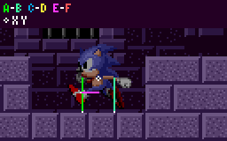 |
| Sensors move **8px down** when ***Ground Angle*** is *0* |

Like in [Main Game Loop](12-main-game-loop.md), wall collision happens before Player's position is updated, so ***X and Y Speed*** is added to the Sensor's position. When the Player collides (when distance isn't positive), The distance will offset **X/Y Speed** to move out of the wall (practically like offsetting ***X/Y Position*** if it was updated), and ***Ground Speed*** is set to *0*.

| **Jump Check** |
| --- |
| When the Player tries jumping, the Ceiling Sensors activate, and if the closest distance found is less than *6* the Player won't bother jumping at all. |

## Airborne

The Player's angle will not rotate the Sensors, and only 4 to 5 will be active at any given time, the game will check the angle of ***X and Y Speed*** through the air, picking a quadrant using the angle found.

| Range | Values | Active Sensors |
| --- | --- | --- |
| **Up** | *316° (224)* to *45° (31)* | Ceiling, and both Wall Sensors. |
| **Right** | *46° (32)* to *135° (95)* | Ground, Ceiling, and the right Wall Sensors. |
| **Down** | *136° (96)* to *225° (159)* | Ground, and both Wall Sensors. |
| **Left** | *226° (135)* to *315° (223)* | Ground, Ceiling, and the left Wall Sensors. |

> [!NOTE]
> A similar result can be found by comparing ***X and Y Speed*** and using the dominant direction being moved along.

| **Ground Sensors** |
| --- |
| Distance above *0* is disregarded. When moving **Down**, distance less than `-(Y Speed + 8)` is disregarded. When moving **Left/Right**, ***Y Speed*** has to be less than *0*. Upon successfully colliding, the distance will offset the Player's ***Y Position***, ***Grounded Flag*** is set, ***Ground Angle*** is updated, and [***Ground Speed*** is calculated](09-slope-physics.md#landing_on_the_ground). |

> [!NOTE]
> Due to these conditions, **Top Solid** blocks can be jumped through.

| **Ceiling Sensors** |  |
| --- | --- |
| The game will then test if the Player should land or not. (see [Slope Physics](09-slope-physics.md#landing_on_the_ground)). Upon successfully colliding with a ceiling, the winning distance will be subtracted from the Player's Y Position, and the same routine happens when landing on the ground. | 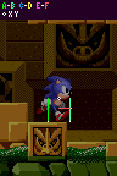 |
| They perform in the exact same way as the Ground Sensors, but flipped. Distance is processed the same as well, mainly being that if the distance is less than *0*, the Player will collide. | 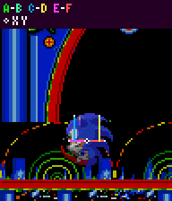 |

| **Push Sensors (Airborne)** |
| --- |
| Unlike on the ground, Push Sensors happen *after* **Player Position** is set, so it changes ***Player X Position*** and sets ***X Speed*** to *0*. |

## Endnotes

| Bugs |
| --- |
| 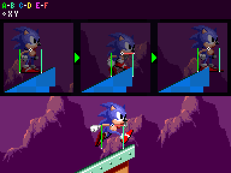 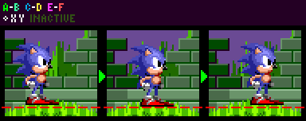 |
| Ground Sensors not using the highest point between the gaps. There's only a few areas where it's noticeable, but applies to all Mega Drive titles. |
| Even if the player looks to be on a flat surface, the **Block's** angle from the left sensor is used regardless. |

| Visualization |
| --- |
| 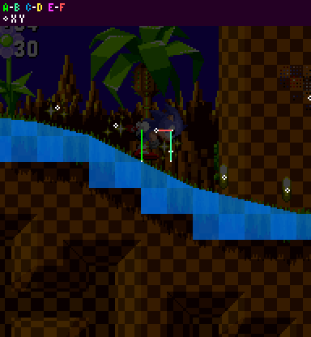 |
| How Sensors interact with [**solid Blocks**](04-terrain-collision.md) during gameplay. You can notice the Sensors snap to the 4 cardinal directions based on the Ground Angle, resulting in the four [collision modes](06-slope-collision.md#360_degree_collision). |

**Notes:**

- *This guide relies on information about **Blocks** and Sensors discussed in [Terrain Collision](04-terrain-collision.md)*.
- *This page is part 1 of 2, detailing 360 Player collisions. For part 2, go to [Slope Physics](09-slope-physics.md)*.

---

[← Terrain Interaction: Collision Layers and Loop Physics](05-terrain-interaction.md) | [Index](../README.md) | [Hitboxes: Player Hitbox and Trigger Areas →](07-hitboxes.md)
