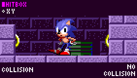
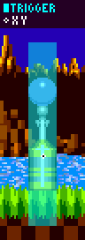

# Hitboxes: Player Hitbox and Trigger Areas

> **Source:** [SPG:Hitboxes](https://info.sonicretro.org/SPG%3AHitboxes)

[← Slope Collision: Sensors, Grounded, 360°, and Airborne](06-slope-collision.md) | [Index](../README.md) | [Solid Objects: Slopes, Platforms, Blocks, and Monitors →](08-solid-objects.md)

---

A hitbox is a rectangular area centered on an object's ***X and Y Position*** that will trigger a reaction with the Player when both their hitboxes overlap. This reaction happens during the **Player's Code**, only reacting to the **first hitbox** overlapped, even if they are overlapping multiple.

> [!NOTE]
> For sizes, see [Game Objects](13-game-objects.md) and [Game Enemies](14-game-enemies.md). For the Player's hitbox, see [Characters](03-characters.md).

| **Hitbox Sizes** |
| --- |
|  |
| Objects use predefined list for radius size pairs. (e.g. *[4,4], [20,20], [12,18],*). This doesn't affect accuracy. |

| **Quirks With Hitboxes** |
| --- |
|  |
| Hitboxes for even-sized sprites sizes appear *1px* too big on their bottom right sides (e.g. rings, *16x16px*, with a *6x6px* hitbox). |

| Object's ***Reaction Type*** | Description |
| --- | --- |
| **Attackable** | *[Attackable](11-forces-subtopics/rebound.md#badniks)* when curled, *[damages](11-forces-subtopics/getting-hit.md)* otherwise (e.g. Badniks, Bosses). |
| **Increment Routine** | Moves to the object's next routine (e.g. Rings, Item Monitors). |
| **Hurt** | Immediately damages the Player (e.g. GHZ Log Bridge spikes). |
| **Special** | Different reactions under specific conditions (e.g. Caterkillers). |

| **Trigger Areas** |
| --- |
|  |
| Some objects perform their own checks on Player's ***X/Y Position*** instead, doesn't affect the Player's hitbox check since it happens during the **Object's Code**. |

---

[← Slope Collision: Sensors, Grounded, 360°, and Airborne](06-slope-collision.md) | [Index](../README.md) | [Solid Objects: Slopes, Platforms, Blocks, and Monitors →](08-solid-objects.md)
