# Solid Objects: Slopes, Platforms, Blocks, and Monitors

> **Source:** [SPG:Solid Objects](https://info.sonicretro.org/SPG%3ASolid_Objects)

[← Hitboxes: Player Hitbox and Trigger Areas](07-hitboxes.md) | [Index](../README.md) | [Slope Physics: Moving, Slipping, 360° Momentum, and Landing →](09-slope-physics.md)

---

There are many objects that the Player can't walk through, these are known as **Solid Objects**, and are a very different to Solid Tiles. Any object that is solid will run it's own code for this to happen, meaning it happens after the player has updated it's physics and collided with the ground. The ***Width, Height, and Push Radii*** of both objects for the size of solidity.

> [!NOTE]
> The Player's ***Push Radius*** is used instead of ***Width Radius***.

## General Solid Object Collision

First, the object checks if the Player is standing on it. The Player has a "standing on object" flag which is set upon landing on one. If they are, it will skip to checking if the Player has [walked off its edges](08-solid-objects.md#standing_on_solid_objects). Otherwise, it will start doing collisions.

| **Order of Events** |
| --- |
| : - Check if it's overlapping the Player. - Check which side the Player is closest to on both axis. - Check how close the Player is to being outside of the object on the closest sides. - Decide whether they're closer horizontally or vertically. - Move the Player out based on the above. |

### Checking for Overlap

For the sake of efficiency, the Player's and objects ***Width and Height Radius*** are combined. These will be shown as ***Combined X and Y Radius***. *1* is added to the ***Combined X Radius***.

| **Overlap** |
| --- |
| `(Player X/Y Position - Object X/Y Position) + Combined X/Y Radius` calculates the difference between ***Player Position*** and *Left/Top* edge of **Combined Box** (add *4* to Top difference). If it's less than 0 or larger than Combined X/Y Diameter, it will exit object collision. After, if Player **X/Y Position** is more than the Object's **X/Y Position**, then we take away **Combined Diameter**, and take away *4* to Top difference when the player is closer to the bottom. If `abs(Left Distance)` is more than `abs(Top Distance)` then collide vertically, otherwise horizontally. |

| 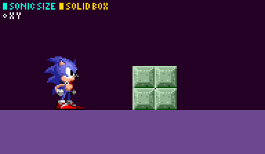 |
| --- |
| How the **new radii** relates to the each of their sizes. |

| 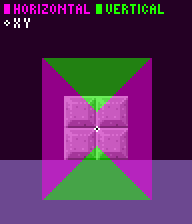 |
| --- |
| The axis depending on where Player ***X and Y Position*** is within the area of a block. |

### Moving The Player Out

Now the Player can be moved out in a given direction by subtracting the **Distance**.

| Left or Right |
| --- |
| We only collide if **Top Distance** is more than *4*, otherwise nothing happens. In *[Sonic (3)](https://info.sonicretro.org/Sonic_3) [& Knuckles](https://info.sonicretro.org/Sonic_%26_Knuckles)* the player will collide vertically instead. When **Distance** is more than *0* and the Player is moving towards the object ***X and Ground Speed*** is set to *0* (**Pushing Flag** will be set while grounded), otherwise speed won't be affected. |
| Popped Downwards |
| If ***Y Speed*** is *0* and the Player is grounded, kill them (from being crushed), then exit. If ***Y Speed*** is more than *0*, it will exit as the Player is away from the object. If the **Distance** is less than 0, the game will subtract it from Player ***Y Position*** and set ***Y Speed*** to *0*. |
| Popped Upwards |
| If the `Distance >= 16` or Player ***Y Speed*** is negative, then exit. Now subtract 4px that was added earlier to the **Distance**. Get the distance from Player ***X Position*** to the Object's right edge. `Comparison = (Player X Position - Object X Position) + Object Width Radius`. If it's less than *0* or more than **Combined X Diameter**, then exit. This assumes the Player is only *1* pixel thick. Finally, subtract the **Distance** from the Player ***Y Position***, with an extra 1px to correctly align them to the top. Set Player ***Y Speed*** and ***Ground Angle*** to *0* , set ***Ground Speed*** equal to ***X Speed***, Then set both Player and Object's **Grounded on Object Flag**. |

> [!NOTE]
> Subpixels** are not accounted for, neither are they reset in any way, collisions and positions happen on the whole **Pixel** level. If the Player keeps pushing towards the object, he has to cover a whole pixel before overlaps happens again.

#### Walking off Edges

If the Player is standing on the object, it will only check if they have walked off it. `Compare = (Player's X Position - object's X Position) + Combined X Radius`. If it's less than 0 or more/equal to **Combined X Diameter**, **Grounded on Object** is unset.

> [!NOTE]
> if the Player is jumping or getting hurt, **Grounded on Object** is unset.

#### Moving On Platforms

While the player is standing on the object, its speeds are added to the Player's position as well.

**Notes:**

- The Player will push *1px* further away leftwards than he will tiles.
- Some objects like Switches or GHZ Rocks has the Player *1px* inside when he stands on them, due to them missing the code to push them *1px* back out.

### Bugs Using This Method

There are a few obvious problems that become apparent when you mess with objects enough.

| **Landing** |
| --- |
| 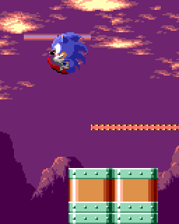 |
| The object doesn't account for **Combined Width Radius** when landing on it. |

| **Priority** |
| --- |
| 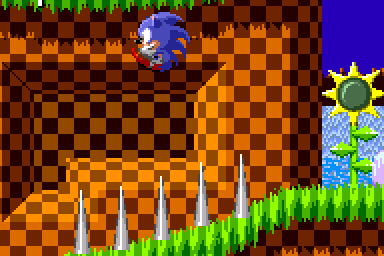 |
| The last object to collide will have priority, the same bug as before is also occurring. |

| **Bottom Overlap** |
| --- |
| 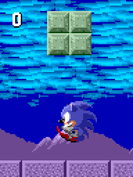 |
| The **4px** offset never gets corrected when hitting the bottom of the object. This can be corrected by accounting for it when checking overlap and calculating distances at the object's bottom. |

| **False Object Ground** |
| --- |
| If you are standing on an object while it gets deleted/unloaded, then you will stay in a grounded state while in the air. |

## Sloped Objects

To achieve this, objects offsets their **Y Position** using a height array at Player's **X Position** while checking collisions, getting reset afterwards.

| **Details** |
| --- |
| 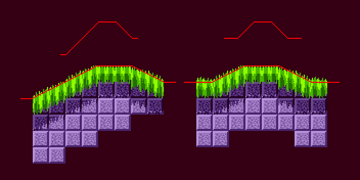 |
| The array's are half size for compression, and then are stretched out for collision. There is 6 extra heights for either side to account for when **X Position** is not directly above the object while standing. |

| **Marble Platform 1** |
| --- |
| 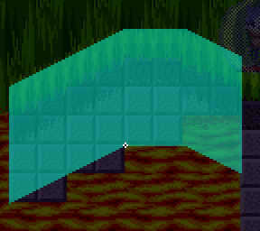 |
| **Height Array:** ```c {32,32,32,32,32,32,33,34,35,36,37,38,39,40,41,42,43,44,45,46,47,48,49,50, 51,52,53,54,55,56,57,58,59,60,61,62,63,64,64,64,64,64,64,64,64,64,64,64, 64,64,64,64,64,64,64,63,62,61,60,59,58,57,56,55,54,53,52,51,50,49,48,48, 48,48,48,48} ``` |

| **Marble Platform 2** |
| --- |
| 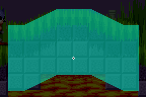 |
| **Height Array:** ```c {32,32,32,32,32,32,32,32,32,32,32,32,32,32,33,34,35,36,37,38,39,40,41,42, 43,44,45,46,47,48,48,48,48,48,48,48,48,48,48,48,48,48,48,48,48,48,48,47, 46,45,44,43,42,41,40,39,38,37,36,35,34,33,32,32,32,32,32,32,32,32,32,32, 32,32,32,32} ``` |

| **Y Shift** |
| --- |
| 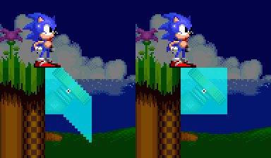 |
| The **Y Position** shifting during the collision process. |

| **Differences To Solid Tiles** |
| --- |
| 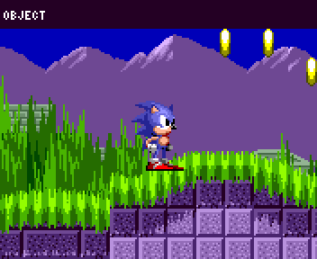 |
| The player's angle is not affected, and the player gets snapped to the center of their position, rather than the highest point their sensors find. |

## Jump Through Platforms

Jump through platforms are small objects which are only solid from the top. Since all the Player can do with platforms is land on them, they use their own code to check for just that, and in a more scrutinized way.

If Player ***Y Speed*** is less/equal than *0*, exit collision. Horizontal overlap runs as normal.

| Variable | Value |
| --- | --- |
| **surface_y** (Object) | **Y Position** - **Height Radius** |
| **bottom_y** (Player) | **Y Position** + **Height Radius** + *4* |

If **surface_y** is more than **bottom_y**, exit & cancel collision as the platform is too low. If `surface_y - bottom_y` is less than *-16* or is more/equal to *0*, exit & cancel collision as the Player is too low also. This value + 3 is added to Player ***Y Position***, along with setting his speeds and **Grounded on Object** flag. Most platforms use their **Width Radius** rather than **Combined Width Radius**, resulting in the Player falling off earlier than expected, this is somewhat hard to notice.

## Pushable Blocks

The block moves 1 **whole pixel** every 2-3 (typically 3) frames whenever pushed, since the player needs to move a **whole pixel** back into the block to push it again. When this happens the Player is also moved, **Ground Speed** is set to *64subpx* (negative on left side).

> [!NOTE]
> for object specific behavior, see [Game Objects](13-game-objects.md#pushable_blocks).

### Monitor Solidity

| **Item Monitor** |  |
| --- | --- |
| 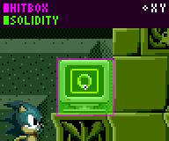 | Solidity works the same, but *4* isn't added during the vertical overlap check. Finding the direction of collision is different. Monitor's disable their collisions while in the air or when the player is rolling. In *[Sonic 1](https://info.sonicretro.org/Sonic_1)*, if the Player's ***Y Speed*** is greater than or equal to *0* collision will also be disabled. Then the monitor will [react accordingly](13-game-objects.md#monitor_hitbox_reaction). The Player can only land on top if `Player Y Position - top (Object Y Position - Combined Box Height Radius) < 16`, and if the Player's ***X Position*** is directly over the Monitor + 4px of extra room either side. If this fails, the player gets pushed out the sides instead. If `Player's X Position is <= Monitor's X`, push the Player to the left, otherwise right. > [!NOTE] > bottom collision never happens. |
| ***Width Radius**: 15 (**Sonic 3:** 14)<br>**Height Radius**: 15 (**Sonic 3:** 16)* |  |

> [!NOTE]
> Sometimes objects which may appear to be solid (like bosses or bumpers) actually only have a hitbox, and when overlapping simply push the Player in the other direction. As a general rule, any seemingly solid object that the Player cannot stand on or push against is most likely actually using a [hitbox](07-hitboxes.md) with some sort of speed or repel related reaction rather than *real* solidity, which will be explained up ahead.

---

[← Hitboxes: Player Hitbox and Trigger Areas](07-hitboxes.md) | [Index](../README.md) | [Slope Physics: Moving, Slipping, 360° Momentum, and Landing →](09-slope-physics.md)
