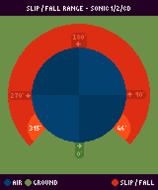
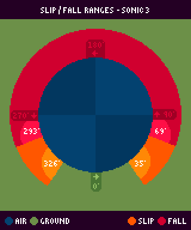
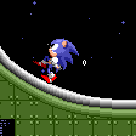
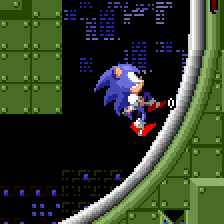
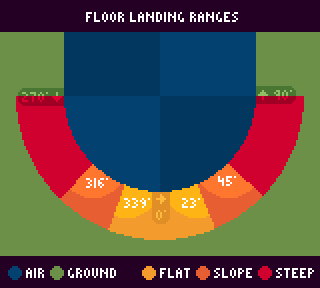
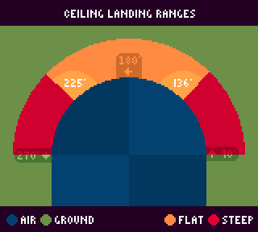

# Slope Physics: Moving, Slipping, 360° Momentum, and Landing

> **Source:** [SPG:Slope Physics](https://info.sonicretro.org/SPG%3ASlope_Physics)

[← Solid Objects: Slopes, Platforms, Blocks, and Monitors](08-solid-objects.md) | [Index](../README.md) | [Forces: Physics Values, Running, Jumping, Rolling, and Impact →](10-forces.md)

---

### Moving Along Slopes

While on the ground, ***Ground Speed*** tells us the speed the player is moving at ***Ground Angle*** + 90 (***Ground Angle*** is the direction the floor points, not the player), with ***X and Y Speed*** being derived from it.

```c
// sin and cos are switched around compared to regular mathematics, due the angle being the direction the floor points instead of the player.
X Speed = Ground Speed * cos(Ground Angle)
Y Speed = Ground Speed * -sin(Ground Angle)

X Position += X Speed;
Y Position += Y Speed;
```

### Slowing Down Uphill And Speeding Up Downhill

While the player moves along slopes, ***Slope Factor*** (pseudo gravity) is subtracted from ***Ground Speed*** `Ground Speed -= Slope Factor * sin(Ground Angle);`. This only happens if the Player isn't in [Ceiling mode](06-slope-collision.md#the_four_modes).

| Slope Factor | Value | Condition |
| --- | --- | --- |
| **Normal** | *0.125 (32spx)* | - |
| **Rolling Uphill** | *0.078125 (20spx)* | `sign(Ground Speed) == sign(sin(Ground Angle)` |
| **Rolling Downhill** | *0.3125 (80spx)* | `sign(Ground Speed) != sign(sin(Ground Angle)` |

> [!NOTE]
> In *[Sonic 3](https://info.sonicretro.org/Sonic_3)* onwards, ***Normal Slope Factor*** is subtracted if it's more/equal to *0.05078125 (13 subpixels)* regardless if ***Ground Speed*** is *0*, So that the Player can't stand on steep slopes. In the previous games it's not subtracted while the player is stopped.

### Falling Down Slopes

If moving too slowly on steep slopes, the Player will briefly lose horizontal control and detach from the ground. This ensures you can't walk slowly on ceilings, or slowly/gradually climb a slope forever.

| Sonic 1/2/CD Method |
| --- |
|  |
| ***Falling:** 46° (32)* to *315° (223)* inclusive. |

| Sonic 3 Method |
| --- |
|  |
| ***Slipping:** 35° (231) to 326° (24)* inclusive.<br>***Falling:** 69° (207) to 293° (48)* inclusive. |

When ***Ground Angle*** is in this range, and ***Ground Speed*** is less than *2.5 (2 pixels, 128 subpixels)*, the Player will slip. The Player is detached from the floor (unset **Grounded** flag), ***Ground Speed*** is set to *0*, and [control lock timer](https://info.sonicretro.org/SPG:Running#Control_Lock) is set to 30. While grounded, both the timer counts down by *1* and **directional input is ignored** until it reaches **zero**.

In *[Sonic 3](https://info.sonicretro.org/Sonic_3)* onwards, the Player will slip at angles above *35°*, and only detach from the floor at angles above than *69°*. ***Ground Speed*** is changed by *0.5* instead of being set to *0*.

|  |
| --- |
| Sonic slipping on the ground, with him immediately [landing back on the ground](09-slope-physics.md#landing_on_the_ground), and slipping again. |

|  |
| --- |
| The player falling off the level when slipping. |

```c
// Sonic 1/2/CD Method
if (player is grounded) {
    if (!controlLock) {
        if (abs(Ground Speed) < 2.5 and (Ground Angle is within falling range)) {
            grounded = false;
            Ground Speed = 0;
            controlLock = 30;
        }
    }
    else controlLock--;
}

// Sonic 3 Method
if (player is grounded) {
    if (!controlLock) {
        if (abs(Ground Speed) < 2.5 and (Ground Angle is within slip range)) {
            controlLock = 30;

            // Should player fall?
            if (Ground Angle is within fall range) grounded = false;
            else {
                // Depending on what side of the player the slope is, add or subtract 0.5 from Ground Speed to slide down it
                if (Ground Angle < 180°) Ground Speed -= 0.5;
                else Ground Speed += 0.5;
            }
        }
    }
    else controlLock--;
}
```

## Landing

| Ground Range |
| --- |
|  |
| A new ***Ground Speed*** is calculated from ***X and Y Speed*** upon impact. |

| Range | Values | Result |
| --- | --- | --- |
| **Flat** | *339° (240)* to *23° (15)* inclusive | ***Ground Speed*** is set to ***X Speed***. |
| **Slope** | *316° (224)* to *45° (32)* inclusive | ***Ground Speed*** is set to <br>`Y Speed * 0.5 * -sign(sin(Ground Angle))`. |
| **Steep** | Any angle outside of Slope range | ***Ground Speed*** is set to `Y Speed * -sign(sin(Ground Angle))`. |

| Ceiling Range |
| --- |
|  |
| If the ceiling isn't steep enough, they will simply bump their head. |

| Range | Values | Result |
| --- | --- | --- |
| **Flat** | *136° (66)* to *225° (191)* inclusive | ***Y Speed*** is set to *0*, ***X Speed, Ground Speed and Ground Angle*** aren't affected. |
| **Steep** | Outside **Flat** Range | ***Ground Speed*** is set to `Y Speed * -sign(sin(Ground Angle))`, and ***Ground Angle*** is updated. |

> [!NOTE]
> In both cases, When moving mostly horizontally the game treats every range as the **Flat** range.

---

[← Solid Objects: Slopes, Platforms, Blocks, and Monitors](08-solid-objects.md) | [Index](../README.md) | [Forces: Physics Values, Running, Jumping, Rolling, and Impact →](10-forces.md)
