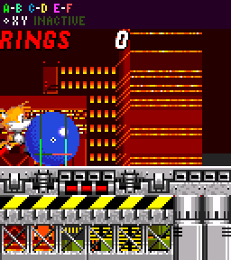

# Forces Subtopic: Jumping & Variable Jump Height

> **Source:** [SPG:Jumping](https://info.sonicretro.org/SPG%3AJumping)

[← Forces Subtopic: Air State & Midair Momentum](air-state.md) | [Index](../../README.md) | [Forces Subtopic: Rolling Physics & Rolling Jump →](rolling.md)

---

## Constants

| Constant | Value |
| --- | --- |
| **jump_force** | *6.5 (6px, 128spx)*, ***Knuckles:** 6px* |
| **gravity_force** | *0.21875 (56spx)* |

## Jump Velocity

Jumping is affected by ***Ground Angle***. **jump_force** is subtracted from ***X and Y Speed*** to preserve the values set from ***Ground Speed***.

```c
X Speed -= jump_force * sin(Ground Angle);
Y Speed -= jump_force * cos(Ground Angle);
```

<br>

### Variable Jump Height

When the jump button is no longer being held while jumping, ***Y Speed*** is capped at *-4*. This is performed before the Player is moved the new position and **gravity_force** is added to ***Y Speed***.

### Bugs

|  |
| --- |
| If you jump while rolling, the Player's hitbox gets reset. Since they're rolling while landing, the hitbox resets again, and *5* is subtracted from ***Y Position***. |

|  |
| --- |
| When you jump, it exits the rest of the movement cycle, meaning the Player won't move at all during that frame. |

## Sonic Mania Jump Differences

Changes were made in [Sonic Mania](https://info.sonicretro.org/Sonic_Mania) to modernize and smooth out the gameplay. **gravity_force** is added when **jump_force** is applied, cancelling the addition of gravity for the first frame in the air. The **Jump Delay** is also fixed, the Player will begin to move upwards on the frame of pressing jump.

> [!NOTE]
> While Mania changes things, the [Retro Engine](https://info.sonicretro.org/Retro_Engine) remakes emulate jumping more accurately.

---

[← Forces Subtopic: Air State & Midair Momentum](air-state.md) | [Index](../../README.md) | [Forces Subtopic: Rolling Physics & Rolling Jump →](rolling.md)
