# Game Objects: Springs, Spikes, Rings, Monitors, and Bumpers

> **Source:** [SPG:Game Objects](https://info.sonicretro.org/SPG%3AGame_Objects)

[← Main Game Loop: Execution Order per Frame](12-main-game-loop.md) | [Index](../README.md) | [Game Enemies: Badniks and Bosses Mechanics →](14-game-enemies.md)

---

Objects move in various ways, some simple and some rather complex. It may be enough to simply observe an object to know how it acts, but this isn't the case most of the time where greater depth is required.

> [!NOTE]
> if an object is spawned in (not originally from the level data), they will not reappear again once they go offscreen horizontally.
> **Note:** ***Frame Duration*** is how many game frames it takes to move to the next animation frame.

## Common Objects

| **Rings** |  |
| --- | --- |
| 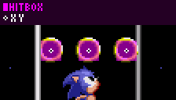 | When a ring is scattered, it has ***Width and Height Radius*** of *8*, a **Gravity** force of *24spx* is applied, **Y Speed** multiplied by *-0.75* when they hit the ground, after 256 frames the object is destroyed, and their Frame Duration is `floor(Lifespan * 2/lifeTimer)` > [!NOTE] > This check only happens every 4 frames, when ***Y Speed*** is less than *0*. |
| ***Hitbox Width Radius:** 6*<br>***Hitbox Height Radius:** 6*<br>***Frame Duration:** 8* |  |

**Springs**

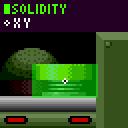

The Spring will change ***Y Speed*** or ***Ground Speed***/***X Speed*** depending on it's direction. When the Player touches the correct side, they are moved **8px** inside of the Spring, and **Propel Speed** is set. **Control Lock** is set to *16* from horizontal springs.

Springs have *3* images, are **compressed**, **relaxed**, and **extended**.  The 1st image plays for *1* frames, 2nd for *2* frames, and 3rd *6* frames, before returning to the 2nd frame, The spring isn't solid while it animates.

| Vertical | Horizontal |
| --- | --- |
| ***Width Radius:*** *16*<br>***Height Radius:*** *8* | ***Width Radius:*** *8*<br>***Height Radius:*** *14* |

***Red Propel Speed***: *16*<br>***Yellow Propel Speed***: *10*

**Horizontal Springs**

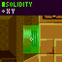

In *[Sonic 3](https://info.sonicretro.org/Sonic_3)* onwards, horizontal springs work in the air too, affecting ***X Speed***. In *[Sonic 2](https://info.sonicretro.org/Sonic_2)* onwards, when the Player stands on a spring and lands on a nearby floor, if `abs(Player Y - Spring Y) <= 24` and `abs(Player X - Spring X) <= 40`, the spring will still launch the Player. If the Player is on the ground when hitting the horizontal spring, the Player's **Control Lock** is set to 16 frames. This is to prevent skidding/de-accelerating immediately after running into it.

**Diagonal Springs**

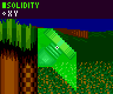

The Player needs to land on top when facing upwards, or hit the bottom when facing downwards, and `Player X > (Spring X - 4)` (< and + 4 when facing left), it's activated. Both **X and Y Position** is moved *8px* into the spring. **Propel Speed** is added to both **X and Y Position**, in *[Sonic CD](https://info.sonicretro.org/Sonic_CD)*, `Propel Speed * sin(45°)` is added instead. Since diagonal Springs are sloped solid objects, they have a **Height Array**.

```c
{16,16,16,16,16,16,16,16,16,16,16,16,14,12,
10,8,6,4,2,0,-2,-4,-4,-4,-4,-4,-4,-4}
```

***Width Radius:*** *16*<br>***Height Radius:*** *16*

| **Spikes** |  |
| --- | --- |
| 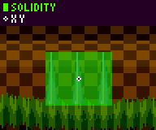 | In *[Sonic 1](https://info.sonicretro.org/Sonic_1)* they vary in size, since they contain multiple spikes. In *[Sonic 2](https://info.sonicretro.org/Sonic_2)* onwards, they use a consistent size. Every *64* frames, a moving spike will retract or extend by *8px* for *4* frames. |
| ***Width Radius**: 16<br>**Height Radius**: 16* |  |

| **Buttons** |  |
| --- | --- |
| 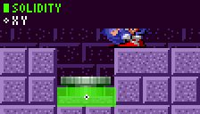 | When the Player stands on it, it appears pressed and it activates its code. |
| ***Width Radius***: *8*<br>***Height Radius***: *5* |  |

**Breakable Blocks/Rocks**

When the Player jumps on a breakable objects, their ***Y Speed*** is set to *-3*.  ***X Speed*** is unaffected.

The block produces 4 segments, with a **Gravity** of *56spx*.

| ***Initial X/Y Speed*** | **Left** | **Right** |
| --- | --- | --- |
| **Top** | *-2, -2* | *2, -2* |
| **Bottom** | *-1, -1* | *1, -1* |

**Breakable Walls**

***X Speed*** must exceed *4.5* to break these walls when rolling ([Knuckles](https://info.sonicretro.org/Knuckles) breaks walls on contact). ***X Speed*** is unaffected. In *[Sonic CD](https://info.sonicretro.org/Sonic_CD)*, the ***X Speed*** threshold is removed.  In *[Sonic & Knuckles](https://info.sonicretro.org/Sonic_%26_Knuckles)*, the Player doesn't move during the frame they hit the wall in.

| **Checkpoints** |
| --- |
|  |
| ***Trigger Offset:** -18, -64<br>**Trigger Size:** 16 x 104*. |

| **Item Monitors** |  |
| --- | --- |
|  | Item Monitors [aren't always solid](08-solid-objects.md#monitor_solidity_conditions), allowing the Player to overlap the hitbox while they are rolling. If Player ***Y Speed*** is more/equal to *0* it will break, if not the monitor will check if `Player Y - Object Y >= 16px`, if it is, then the Monitor's **Y Speed** is set to -1px, 128spx, and has a **Gravity** of *56spx*. > [!NOTE] > In *[Sonic & Knuckles](https://info.sonicretro.org/Sonic_%26_Knuckles)*, it will break instead. |
| ***Width Radius**: 15 (**S3:** 16)<br>**Height Radius**: 15 (**S3:** 14)<br>**Hitbox Radii**: 16* |  |

| **Bumpers** |  |
| --- | --- |
| 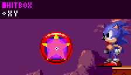 | On overlap, Player ***X and Y Speed*** is set to `7 * cos(p)` and `7 * -sin(p)`, **p** is the angle from the Bumper to the Player. |
| ***Hitbox Radii**: 8* |  |

| **Pushable Blocks** |
| --- |
| If no floor is found below their center, the block moves at a speed of *4px* away from the ledge they have moved 16 pixels, and then falls and lands as normal. > [!NOTE] > Rest of the mechanics can be found on the [Solid Objects](08-solid-objects.md#pushable_blocks) page. |

| **Bridges** |  |
| --- | --- |
| 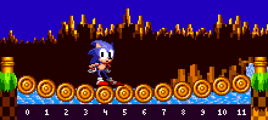 | The middle (right) log acts as a [jump through platform](08-solid-objects.md#jump_through_platforms) as wide as the entire bridge (accounts for being uncentred), only if `Y Speed >= 0`, and ***X Position*** is within ***Width Radius***. The other logs are purely visual. [Platform Walk-Off](08-solid-objects.md#walking_off_edges) is applied on both ends of the bridge. While standing on the bridge, The Player's ***Y Position*** is set above the log at ***stand_log***. ```c // log_width is the sprite width of the logs that comprise of the bridge. Usually 16 pixels. stand_log = floor((X Position - Left Most X Position of Bridge) / log_width) + 1 ``` **Max Dip** is an array of how low the ***stand_log*** can be, it goes up in 2's until the midpoint, where the other side mirrors the first half. ```c {2, 4, 6, 4, 2} // 5 Log bridge. {2, 4, 6, 8, 10, 12, 12, 10, 8, 6, 4, 2} // 12 Log bridge. ``` |
| ***Width Radius:** 4 * segments(?)<br>**Height Radius:** 4(?)* |  |
| ***dip_angle*** Counts to 90 when the Player is standing on top, and down to 0 when the Player gets off. It takes 16 frames for bridge to return itself to its original position from full tension, changing by *5.625° (4)*. ```c // loop for determining the position of all the bridge logs // based on the current log the Player is standing on. (stand_log) // the first log in the bridge is always index 0. For log in log_count difference = abs((log + 1) - stand_log); // returns how many logs away from the stand_log If (log < current_log) // is log to our left? distance = 1 - (difference / stand_log); // fraction of how far away from the left side else // our log is to the right distance = 1 - (difference / ((log_count - current_log) + 1)); // fraction of how far away from the right side Log Y Position = Bridge Y Position + (max_dip[stand_log - 1] * sin(dip_angle) * sin(distance * 90)); ``` |  |

| **Air Bubble Maker** |
| --- |
| First, the object will wait 128 to 255 frames, then 1 to 6 bubbles will be created at 0 to 31 frame intervals. The bubbles are created at the same ***X/Y Position*** but with an offset of -8 to 7 across the ***X Position***. Then the cycle is repeated. The size of these bubbles are taken from one of these randomly chosen lists. ```c Set 1: [Small, Small, Small, Small, Medium, Small] Set 2: [Small, Small, Small, Medium, Small, Small] Set 3: [Medium, Small, Medium, Small, Small, Small] Set 4: [Small, Medium, Small, Small, Medium, Small] ``` <br> The object's **Large Air Bubble Frequency** can be set to happen every, 2nd, 3rd, or longer times it creates bubbles, only one of the created bubbles is turned into a large bubble, a 1 in 4 chance for each, the last bubble will be converted if none were previously. |

| **Air Bubbles** |  |
| --- | --- |
| Each bubble object has a ***Y Speed*** of *-0.5 (-128 subpixels)*. They sway back and forth (via a sine wave) once every 128 frames, moving 8 pixels horizontally in total. A bubble will pop if it's ***Y Position*** reaches the water's surface Y. The frame duration for these are 1 sub-frame every 16 frames. |  |
| **Large Air Bubble** |  |
| 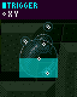 | When it's fully sized, the [Trigger Area](07-hitboxes.md#trigger_areas) is active. > [!NOTE] > For the effects of breathing a bubble, see [Underwater](11-forces-subtopics/underwater.md#large_air_bubbles). (TODO: CHANGE WHEN UPDATED) |
| ***Trigger Offset:** -16, 0<br>**Trigger Size:**32 x 16*. |  |

| **Sonic 1 Capsule** |  |
| --- | --- |
| 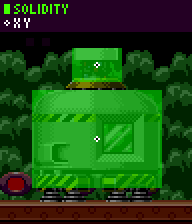 | For *60* frames, an exposition sprite is created every *8th* frame, at a random **X/Y Offset** in a range of 31px on both axis. The capsule will switch to the exploded frame. |
| ***Random Spawn Frames:*** 150 |  |

| **Sonic 2 Capsule** |  |
| --- | --- |
| 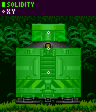 | An explosion spawns at lock's position. The lock moves at an ***X Speed*** of *8*, and a ***Y Speed*** of *-4*. It will then wait *29* frames. |
| ***Random Spawn Frames:*** 180 |  |

| **End Capsules** |
| --- |
| After this, *8* animals are spawned at capsule's `X Position - 28`, and `Y Position + 32`, horizontally separated by *7*, a timer starts at *154* and decreases by *8* for each subsequent animal, jumping starts when an animal's timer reaches zero. Then, for ***Random Spawn Frames***, every *8th* frame, an animal is spawned at a random ***X Position*** amongst the group, with their timer set to *12*. When all animal objects have disappeared, the act clear messages will appear. |

**S Tunnels**

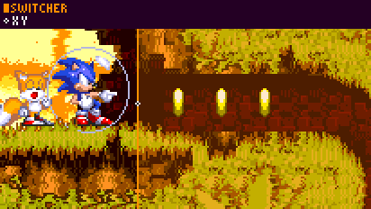

In *[Sonic 1](https://info.sonicretro.org/Sonic_1)*, the player will simply locked into a roll state whenever they enter a tunnel **Metablock**. In [Sonic 3](https://info.sonicretro.org/Sonic_3), an object similar to [Layer Switchers](05-terrain-interaction.md) is used instead, it puts the player in a roll state while in a tunnel, and has some additional flags.

| Flag | Description |
| --- | --- |
| **Control Lock** | Locks player control. |
| **Curl Lock** | Keeps the player curled. |
| **Wall Snap** | Snaps the player to walls. |

> [!NOTE]
> Due to how rolling works, if ***Ground Speed*** is *0*, it will be set to *2*.

| **Seesaws** |  |
| --- | --- |
| 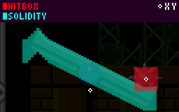 | ```c [36,36,38,40,42,44,42,40,38,36,35,34,33,32, 31,30,29,28,27,26,25,24,23,22,21,20,19,18, 17,16,15,14,13,12,11,10,9,8,7,6,5,4,3,2, 2,2,2,2] ``` > [!NOTE] > Because it's a platform, it has no extra slope information on either side. This array is flipped when tilting left, the value will always be *21* when straight. It will remain straight if Player ***X Position*** is within a *8px* radius, otherwise it will slope to whatever side they are on. The spike ball simply has a **Hitbox Radii** of *8*. |
| ***Width Radius:*** *48*<br>***Height Radius:*** *8* |  |
| When the seesaw's rotation is changed, it will launch a spike ball upwards. The speed of which is based on both where you landed and your landing speed. If the seesaw is straight, the spike ball launches with an ***X Speed*** of *1px, 20spx* and ***Y Speed*** of -8px, 24spx. Otherwise, if the Player's ***Y Speed*** is less than *10px* on landing, the spike ball launches with speeds of *204spx* and *-10px, 240spx*. Otherwise, it launches with speeds of *160spx* and *-14px*. The spike ball has a **Gravity** of *56spx*. Upon landing, the Player's ***Y Speed*** is set to what the spike ball launched with. |  |

**Flippers** *([Casino Night Zone](https://info.sonicretro.org/Casino_Night_Zone))*

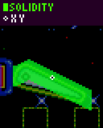

| **Down** | **Straight** | **Up** |
| --- | --- | --- |
| ```c [7,7,7,7,7,7,7,8, 9,10,11,10,9,8,7, 6,5,4,3,2,1,0,-1, -2,-3,-4,-5,-6,-7, -8,-9,-10,-11,-12, -13,-14] ``` | ```c [6,6,6,6,6,6,7, 8,9,9,9,9,9,9,8, 8,8,8,8,8,7,7,7, 7,6,6,6,6,5,5,4, 4,4,4,4,4] ``` | ```c [5,5,5,5,5,6,7,8,9, 10,11,11,12,12,13,13, 14,14,15,15,16,16,17, 17,18,18,17,17,16,16, 16,16,16,16,16,16] ``` |

When the Player lands on them, they are forced into a roll. While on them, ***Ground Speed*** is set to 1 (or -1 if the flipper is facing left), and horizontal input is ignored. When the flipper is activated, each subimage (straight, up, straight), lasts for *4* frames. Then it resets to being down, uses it's accompanying height array for collision.

***Width Radius:** 24<br>**Height Radius:** 6*

### Flipping The Player

When the player jumps the flipper activates, and is launched with new ***X and Y Speeds*** based on their ***X Position*** relative to the flipper.

> [!NOTE]
> The jumping flag is not set when launched.

```c
// Get the difference between the Player's X Position and the Flipper's X Position, offset by 35
var xdiff;
if flipper_direction == 1 // facing right
   x_diff = (player X - flipper X) + 35;
else
   x_diff = (flipper X - player X) + 35;

// Difference modified to be used as speed multiplier
var multiplier = min(x_diff, 64);
multiplier = -multiplier / 8;
multiplier += 8;

// Difference modified to be used as angle for sine and cosine
var angle = (x_diff / 4) + 64;

// hex to degree angle to use for (cos)sine in modern game engines
var degree_angle = (256 - angle) * 1.40625;

// Calculate sine and cosine
var sine = sin(degree_angle) * multiplier;
var cosine = cos(degree_angle) * multiplier;

// Launch player
player's X Speed = cosine * flipper_direction;
player's Y Speed = -sine;
```

## Fans (Horizontal)

The horizontal fans in [Star Light Zone](https://info.sonicretro.org/Star_Light_Zone) push the Player back, but don't actually affect their speed at all. What is actually happening is just an ***X Position*** shift each frame, based on how far away from the fan the Player is.

Because it doesn't affect the Player's speeds, the Player can accelerate and run or jump full speed while in the fan's influence.

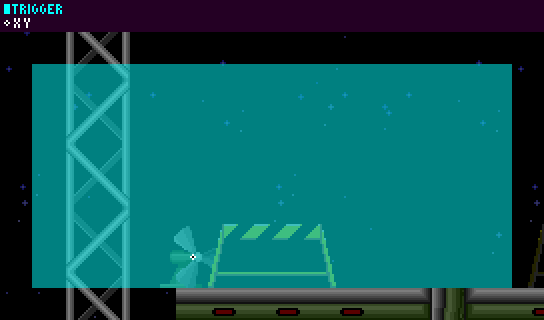

Horizontal Fans use a [Trigger Area](07-hitboxes.md#trigger_areas) instead of hitboxes.

If the Fan is facing right, the [trigger](07-hitboxes.md#trigger_areas) top left is `Fan's X Position - 80` and `Fan's Y Position - 96`, otherwise the trigger top left is`Fan's X Position - 160` and `Fan's Y Position - 96`. The trigger size is *240* x *112*. This results in an area of *80* pixels behind the Fan, and *160* pixels in front of the Fan.

### Fan Force

Here's some code which emulates how the game calculates how far to push the Player back:

```c
// Distance
var x_diff = Player's X Position - Fan's X Position;
if fan's direction == -1 //(1 facing right, -1 facing left)
   x_diff = -x_diff;

// Calculate force
var fan_force = floor(x_diff);
if x_diff < 0
{
   // The Player is behind the fan (will invert and "double" the distance, because it is half the size of the area infront)
   fan_force = -(fan_force - 1)
   fan_force = fan_force * 2;
}

// Calculate final force based on distance
fan_force = fan_force + 96;
fan_force = (256 - fan_force) >> 4; // ">> 4" here is equivalent to dividing by 16, floored. You can substitute it for normal division to get a smoother motion.
if (Fan's direction == -1)
   fan_force = -fan_force;

// Move the player
Player's X Position += fan_force;
```

## Fans (Vertical)

Vertical fans from [Oil Ocean Zone](https://info.sonicretro.org/Oil_Ocean_Zone) work almost exactly the same way as horizontal fans, but on the Y axis.

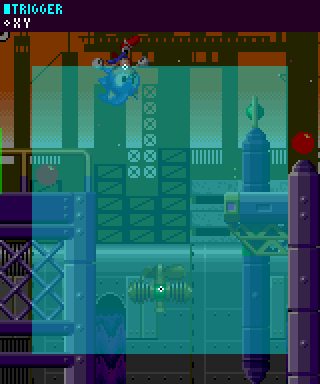

Vertical Fans also use a [Trigger Area](07-hitboxes.md#trigger_areas) instead of hitboxes.

The [trigger](07-hitboxes.md#trigger_areas) top left is `Fan's X Position - 64` and `(Fan's Y Position - 96) - Oscillation`, the trigger size is *128* x *144*. This results in an area of *48* pixels below the Fan, and *96* pixels above the Fan, offset by the oscillation.

> [!NOTE]
> *"Oscillation" is a value which oscillates from 0 to 15 and back on a sine wave once every 88 frames*

### Fan Force

Here's some code which emulates how the game calculates how far to push the Player upwards:

```c
// Distances
var x_diff = Player's X Position - Fan's X Position;
var y_diff = (Player's Y Position + oscillation) - Fan's Y Position; // oscillation is a value which oscillates from 0 to 15 and back on a sine wave once every 88 frames

// Calculate force
var fan_force = floor(y_diff);
if y_diff > 0
{
   fan_force = -(fan_force + 1)
   fan_force = fan_force * 2;
}
fan_force = fan_force + 96;
fan_force = (-fan_force) >> 4; // ">> 4" here is equivalent to dividing by 16, floored. You can substitute it for normal division to get a smoother motion.

// Move the player
player's Y Position += fan_force;
player's Y Speed = 0;
```

## Conveyor Belts

A [Scrap Brain Zone](https://info.sonicretro.org/Scrap_Brain_Zone) conveyor belt will simply add the belt speed to the Player's ***X Position***, their speeds are unaffected.

## Spring Ramps

Spring ramps aren't quite as simple as normal Springs. Firstly, they have a specific region where they actuate.

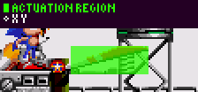

The ramp will activate if their ***X Position*** is within the green region as they stand on it.

When a Spring ramp activates they don't bounce the Player instantly, instead, the Player moves down a bit as the animation plays. There are two subimages, normal and down, and these both have different collision height arrays as shown below.

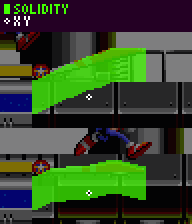

Spring ramps are sloped solid objects. They have a ***Width Radius*** of *28* and a ***Height Radius*** of *8*, resulting in a *57* x *17* rectangle, this is their solid size.

The height arrays are as follows:

When relaxed:

```c
[8,  8,  8,  8,  8,  8,
8,  9, 10, 11, 12, 13, 14, 15, 16, 16, 17, 18, 19, 20, 20, 21, 21, 22, 23, 24, 24, 24, 24, 24, 24, 24, 24, 24,
24, 24, 24, 24, 24, 24]
```

When pressed:

```c
[8,  8,  8,  8,  8,  8,
8,  9, 10, 11, 12, 12, 12, 12, 13, 13, 13, 13, 13, 13, 14, 14, 15, 15, 16, 16, 16, 16, 15, 15, 14, 14, 13, 13,
13, 13, 13, 13, 13, 13]
```

Once activated it plays the down subimage for 4 frames, and the Player will lower with it but is otherwise unaffected and will keep walking. On the next frame it's back up and the Player is raised again but still unaffected, on the frame after this they will actually be in the air.

So how fast do they bounce the Player? Well, that's not perfectly simple either. It will bounce the Player up with a ***Y Speed*** of -4, and depending on their ***X Position*** relative to the ramp it will subtract a second modifier from their ***Y Speed***. This is all dependant on the positions where the Player's ***X Position*** is right now as they are bounced, not where they were when activated it.

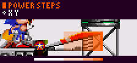

From left to right this modifier can be 0, 1, 2, 3 or 4.

So if the Player happened to be in section 3, their ***Y Speed*** would become *-4*, minus the modifier of *2*, resulting in *-6*.

***X Speed*** is also affected, if absolute ***X Speed*** happens to be larger than or equal to *4*, the modifier will be added to (or subtracted from) ***X Speed***. If the Player is in the third section (which has a modifier of *2*), and they have an ***X Speed*** of *5*, their ***X Speed*** would become `5 + 2`.

> [!NOTE]
> This all gets capped at *6* in Sonic 2 due to the speed cap still being present in the air.

| **Spring Caps** ([Chemical Plant Zone](https://info.sonicretro.org/Chemical_Plant_Zone)) |
| --- |
| Works much like springboards, but sets Player ***Y Speed*** to *-10px, 128spx* upon collision. |

| **Spinners** ([Chemical Plant Zone](https://info.sonicretro.org/Chemical_Plant_Zone)) |
| --- |
| On overlap, ***Ground Speed*** is set to 16, unless already moving faster. |

| **Ski Lifts** ([Hill Top Zone](https://info.sonicretro.org/Hill_Top_Zone)) |
| --- |
| Once the Player lands on it, it will move with an ***X Speed*** of *2*, and a ***Y Speed*** of *1*. |

| **Cannons** ([Carnival Night Zone](https://info.sonicretro.org/Carnival_Night_Zone)) |
| --- |
| Upon launching, Player ***X Speed*** is set to `16 * cosine(p)`, and ***Y Speed*** to `16 * -sine(p)`, **p** is the angle of the cannon. |

| **Bouncy Mushrooms** ([Mushroom Hill Zone](https://info.sonicretro.org/Mushroom_Hill_Zone)) |
| --- |
| These work similar to springs, only each successive bounce is higher than the last, up to three bounces. The first bounce sets ***Y Speed*** to *-6px 128spx*, the second, *-7px, 128spx*, and the third, *-8px 128spx*. |

| **Points** |
| --- |
| After it spawns at the object's X and ***Y Position***, it begins with a ***Y Speed*** of *-3px*, and will slow down by *24xpx* each frame. Once it is no longer moving, it will vanish. This will take around *32* frames. |

| **Balloons** |
| --- |
| 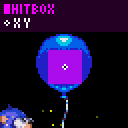 |
| On overlap, Player ***Y Speed*** is set to *-7px*. ***X Speed*** is not affected. |
| ***Hitbox Radii**: 8* |

| **Spike Traps** ([Marble Zone](https://info.sonicretro.org/Marble_Zone)) |  |
| --- | --- |
| 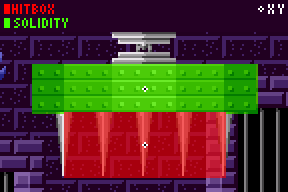 | Spike traps rise by *128spx* each frame. The length in which they start to fall varies. Once they do, their ***Y Speed*** increases by *112spx* each frame. once they reach full length, 60 frames is waited before rising again. The damage hitbox simply hurts the Player upon contact and doesn't have any solidity. |

---

[← Main Game Loop: Execution Order per Frame](12-main-game-loop.md) | [Index](../README.md) | [Game Enemies: Badniks and Bosses Mechanics →](14-game-enemies.md)
