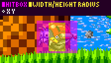
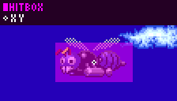
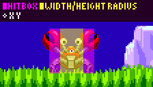
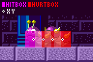
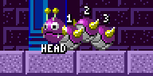
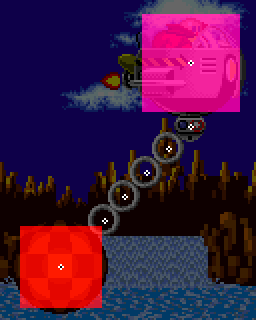

# Game Enemies: Badniks and Bosses Mechanics

> **Source:** [SPG:Game Enemies](https://info.sonicretro.org/SPG%3AGame_Enemies)

[← Game Objects: Springs, Spikes, Rings, Monitors, and Bumpers](13-game-objects.md) | [Index](../README.md) | [Ring Loss: Scatter Trajectories, Speeds, and Timers →](15-ring-loss.md)

---

Much like other objects, Badniks behave and are constructed in many different ways, some simple and some rather more intricate. This page will cover just a few examples of specific Badniks and Bosses ranging from simple to complex to help you understand how they are put together.

> [!NOTE]
> Floor below is usually with a sensor at ***X Position, Y Position + Height Radius***, and the floor will be ignored if the distance found is less than -8 or greater than 12, unless stated otherwise.

## Interaction

Both Badniks and Bosses typically have at least 1 main [attackable hitbox](07-hitboxes.md#attackable_hitboxes).

## Badniks

| **Motobugs** |  |
| --- | --- |
|  | When no floor is found, there's a 1 second delay before turning. Floor checking doesn't happen while turning. |
| ***Width Radius:** 8<br>**Height Radius:** 14<br>**Hitbox Width Radius:** 20<br>**Hitbox Height Radius:** 16<br>**Speed:** 1px* |  |

| **Choppers** |
| --- |
|  |
| ***Gravity:** 24spx<br>**Hitbox Width Radius:** 12<br>**Hitbox Height Radius:** 16* |
| Choppers bounce with a speed of -7 at their **Y Position** origin. |

**Buzz Bombers**



The wings animate every *2* frames. If Player **X Position** is within a *96px* radius, it will wait for *29* frames before shooting. The 3 shooting sprites last for *14*, *8*, and *9* frames respectively. When the animation ends, the projectile object spawns. 29 frames later, the Buzz Bomber will begin flying again.

| Projectiles |
| --- |
| ***X Speed:** 2<br>**Y Speed:** -2* |

***Hitbox Width Radius:** 24<br>**Hitbox Height Radius:** 12<br>**Speed:** 4px*

| **Crabmeats** |  |
| --- | --- |
|  | Crabmeats walk for 128 frames before stopping. They will also stop if the floor below isn't found (on every odd frame, 16 is added to the sensors **X Position** in their moving direction). The stop lasts for 90 frames before firing projectiles, then waits 60 frames before walking in the opposite direction. The two projectiles spawn offset to **X Position** at +/- *16px*, with a **Y Speed** of -4, **X Speed** of +/- *1px*, and **Gravity** of *56spx*. |
| ***Hitbox Radii:** 16<br>**Width Radius:** 8<br>**Height Radius:** 16<br>**Speed:** 128spx* |  |

### Caterkillers

Caterkillers are comprised of 4 segments, the head, and 3 body segments. The **Head Segment** is the only vulnerable part, while the body segments have hitboxes which damage the player (these also trigger the scattering upon being touched, but their main job is to hurt Sonic and they cannot be destroyed like a Badnik normally can). They head will also trigger scattering if not destroyed when touched.



The head segment has a Width Radius of 8 and a Height Radius of 7, resulting in a 17 x 15 rectangle. The hitboxes of all segments are just a little bit bigger, with a width radius of 8 and a height radius of 8, resulting in a 17 x 17 rectangle.

Only the head segment has a sensor for detecting the floor at it's X Position and Y Position + Height Radius. It is only active when the head moves a pixel.

The way they move is rather complex compared to other enemies. Firstly, let's go over timings.

Caterkillers scrunch up then flatten/stretch out, on a loop. They spend 16 frames moving, then 8 frames staying still. So this would be scrunching up for 16 frames, then not moving for 8, then stretching out for 16, then not moving for 8, and repeat.

Firstly this will go over how they work while on open ground, then what they do to track properly on slopes, then cover what they do when meeting a wall or a ledge.

For easier reference, we will number the segments like so:



#### Scrunching Up

When starting to scrunch (and if the Cater killer isn't turning at all), each body part should already be spaced 12px apart. So if the **Head Segment'**s X position was 50, the next body segment would have an X position of 62, or 38 if it is facing right, and so on. It's mouth is also set to open.

The **Head Segment** won't proceed (its X speed is 0), instead this is where the back end catches up with the front end.

**Segment 1** will proceed with the head's X speed plus -0.25 (0.25 when the segment is moving right).
This results in a movement of 4 pixels within the 16 frames.

**Segment 2** will move with Segment 1's X speed plus -0.25 (0.25 when the segment is moving right).
This results in a movement of 8 pixels within the 16 frames.

**Segment 3** will move with Segment 2's X speed plus -0.25 (0.25 when the segment is moving right).
This results in a movement of 12 pixels within the 16 frames.

Both the **Head Segment** and **Segment 2** will animate upwards 7 pixels within the 16 frames. The other segments remain flat to the floor. *Animate* being the keyword here, the actual position and hitbox do not rise at all.

#### Stretching Out

When starting to stretch out (and if the Caterkiller isn't turning at all), each body part should already be spaced 8px apart. So if the **Head Segment'**s X position was 50, the next body segment would have an X position of 58, or 42 if it is facing right, and so on. It's mouth is also set to closed.

Stretching out is basically the opposite, where the head moves forward and the back end stays still.

The **Head Segment** will proceed with an X speed of -0.75 (0.75 when moving right).
This results in a movement of 12 pixels within the 16 frames.

**Segment 1** will proceed with the head's speed plus 0.25 (-0.25 when the segment is moving right).
This results in a movement of 8 pixels within the 16 frames.

**Segment 2** will proceed with Segment 1's X speed plus 0.25 (-0.25 when the segment is moving right).
This results in a movement of 4 pixels within the 16 frames.

**Segment 3** doesn't proceed, it has Segment 2's X speed plus 0.25 (-0.25 when the segment is moving right).
This results in 0 X speed.

This time, both the **Head Segment** and **Segment 2** will animate downwards 7 pixels within the 16 frames, back to being flat to the floor.

#### Animation

As a segment rises, it does so in a particular way.

Across the 16 frames, this is how many pixels the raised segments will be from the ground while scrunching up.

```c
0, 0, 0, 0, 1, 1, 2, 3, 4, 4, 5, 6, 6, 7, 7, 7
```

This will be reversed as they move back down while stretching out.

In your framework this could be baked into frames of animation or as an extra y offset subtracted from the draw position.

#### Slopes

The **Head Segment** sticks to the floor using a downwards sensor much like Sonic does as it moves. They will turn the floor if the distance found is less than -8 or greater than 12.

Well, each body part needs to also stick to slopes as they move.
This is done by having the **Head Segment** record and remember all of it's Y offsets in a small array (only on the movement frames) and having the next body part read from this as they move. This saves the game having to read data from tiles for each body segment. This array should be around 16 entries long.

#### Y Offset Arrays

*Note: We will assume that position 0 of an array is the oldest value, while new values are added to the end.*

After colliding with the floor, X Speed is added to it's X Position, the **Head Segment** will check each frame whether it has moved a pixel - this being if it's floored X position after moving does **not** equal it's floored X position *before* moving.

If movement has occurred, the current Y offset will be added to it's Y offset array.

The other segments will use this array to reposition themselves. Using **Segment 1** as an example, it has an index which it will read from the array, this should be at around 12 back from the most recent value. This is because the segments are 12 pixels away from each other when fully stretched.

When **Segment 1** moves a pixel (which occurs at different frames to the **Head Segment**), it will trim the oldest value from the **Head Segment'**s array (effectively moving 1 Y offset array entry into the future). Then, it will read a value from the **Head Segment'**s array at the index position. If this value is valid, the Y position of the segment will be adjusted according to the read value. After this happens, whatever the value is, **Segment 1** adds this value to it's **own** array for **Segment 2** to use in the exact same way.

**Segment 2** and **Segment 3** work in the exact same way, except **Segment 2** will use **Segment 1'**s array, and **Segment 3** will use **Segment 2'**s array (also, **Segment 3** doesn't need to record any values to it's own array, being the last segment).

The result of this is while the arrays are all added to at the rate of that segment's motion, it's read from at the rate of the next segment's motion. This ensures that each segment will meet the same Y offset value when arriving at a particular X position.

*Note: There's a possibility of this de-syncing if the timing of the states aren't perfectly in sync or speeds of the segments aren't perfectly balanced.*

#### Ledges And Walls

When the Caterkiller has to turn, it doesn't suddenly stop or even turn all at once. Each body segment independently changes direction.

On the frames that the **Head Segment** meets a ledge or touches a wall, instead of recording a Y offset from the ground, a value of 128 is stored in the array. This will signal the next segment to turn around also, when they read it. Segments will not align themselves to the ground if nothing is found below or they have encountered a turning signal. The segment may spend 2 or more frames off the side of a ledge by 1 pixel however since the array only updates upon a pixel of movement, a turn signal isn't recorded multiple times.

So, one by one, the segments will change direction as they encounter this signal in the arrays, and each reach the point of turn.

On the movement frame a segment (including the head) turns, the fractional part of it's X position needs to be flipped. This is to ensure the segments are always perfectly pixel aligned after the 16 frame movement has passed. So, if the **Head Segment** has been moving left, and is at an X position of 50.75 when it turns, the 0.75 portion of the position is flipped (1-0.75 = 0.25) resulting in an X position of 50.25 afterwards. This happens for any segment and will help keep the segment at the same position within a pixel relative to it's direction, so nothing de-syncs.

*Notes:*

- *1 pixel seems to be subtracted from a segment's X position when it turns to face left.*
- *The segment will not stop at any point during a turn, and will continue to move in whichever direction it's now facing as if nothing happened.*

#### Scattering

When you touch any part of the Caterkiller (unless in doing so you destroy it's head), it will break apart and each segment will bounce away.

##### Segment Scatter Speed

Upon scattering, each segment first is given its own X speed. Here, starting at the **Head Segment** and ending with **Segment 3**.

```c
2, 1.5, -1.5, -2
```

This speed is negated if the segment is facing to the right. On this frame, their Y speed is set to -4

These will fall with a gravity of (0.21875), and upon contact with the floor their Y speed is set to -4 each time as a bounce.

## Bosses

Bosses work very similarly to Badniks collision-wise. The key difference is hitting them doesn't immediately destroy it, the boss will visually flash to show damage for 32 frames. While flashing, the hitbox is not active. This is to prevent spamming attacks and allow Sonic to [rebound from the boss](11-forces-subtopics/rebound.md#bosses).

In Sonic 1, a flying Eggmobile will typically bob up and down (using sine a wave) with a range of 8 pixels once every 128 frames.

Once destroyed, it explodes for 180 frames, before dropping, raising a bit, and then flying away with an X Speed of 4 and a Y Speed of -0.5.

### Green Hill Zone Boss

The Green Hill Zone boss is comprised of 2 main elements, the Eggmobile and the Boulder.



The Eggmobile has a attackable hitbox with a width radius of 24 and a height radius of 24, resulting in a 49 x 49 rectangle.

The Boulder has a [hurt hitbox](07-hitboxes.md#hurt_hitboxes) with a width radius of 20 and a height radius of 20, resulting in a 41 x 41 rectangle.

#### Movement

Upon entering and settling into the starting position at the centre X of the screen, the Boulder will spawn at the Eggmobile's X and Y Position and begin to lower 1px per frame until it is 128 pixels below the Eggmobile.

After this, the Eggmobile waits 24 frames before doing it's initial movement.

##### Initial Movement

The Boulder will start to swing towards the right, with one full back and forth swing every 256 frames.

The Eggmobile will start moving to the left with an X Speed of -0.25. This is because the movement starts at the centre the very first time and not at one of the sides, and because the chain is starting at the bottom and has to swing up.

This lasts for 128 frames, and the Boulder has swung up and to the left, and back down again, and is directly under the Eggmobile. The Eggmobile will then stop and rotate to the right. This when the main movement starts.

##### Main Movement

> [!NOTE]
>

- *The boulder continues to swing the same speed throughout.*

Because the Eggmobile pauses when the Boulder is directly below, it waits 64 frames for the Boulder to continue and swing up behind. When the boulder is at it's peak behind the Eggmobile, it will move at an X Speed of 1 or -1 depending on the current direction.

Movement also lasts for 64 frames, and the boulder has swung down and is directly below the Eggmobile again. The Eggmobile turns around and pauses, and the loop starts again, flipped.

---

[← Game Objects: Springs, Spikes, Rings, Monitors, and Bumpers](13-game-objects.md) | [Index](../README.md) | [Ring Loss: Scatter Trajectories, Speeds, and Timers →](15-ring-loss.md)
