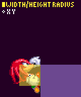

# Special Abilities: Spindash, Peel Out, Drop Dash, Flight, Glide

> **Source:** [SPG:Special Abilities](https://info.sonicretro.org/SPG%3ASpecial_Abilities)

[← Ring Loss: Scatter Trajectories, Speeds, and Timers](15-ring-loss.md) | [Index](../README.md) | [Elemental Shields: Flame, Bubble, and Lightning Shield Actions →](17-elemental-shields.md)

---

<br>

## Spindash

When you first begin the Spindash, ***Spin Rev (Spindash Revolutions)*** is set to **0**.  Every button press, **Spin Rev** increases by *2*, up to a maximum of *8*.  While the Spindash is charging, **Spin Rev** is being affected by drag.

```c
spinrev -= ((spinrev div 0.125) / 256)   // "div" is division ignoring any remainder
```

This is exactly like the [air drag](11-forces-subtopics/air-state.md#air_drag) calculation.

When Down is released, the Player launches with a **Ground Speed** of `8 + (floor(spinRev) / 2)`. The highest speed achievable through the Spindash is *12*, but it's nearly impossible due to the imposed drag.

> [!NOTE]
> Water has no effect on the release speed.

### Spindash (Sonic CD)

If player releases  *45* frames after the spindash started, they will launch at a **Ground Speed** of *12*, otherwise nothing happens.

#### Super Peel Out (Sonic CD)

This works in the same fashion, but waits *30* frames after  is held instead.

### Drop Dash (Mania)

| **Constants** | Value | Super |
| --- | --- | --- |
| **Drop Speed** | *8* | *12* |
| **Drop Max** | *12* | *13* |

The dropdash starts 20 frames after jump is pressed again. Once charged, ground speed will be set when the Player reaches the ground.

As Sonic hits the ground, **Ground Speed**  is calculated [as normal](09-slope-physics.md#landing_on_the_ground), this new **Ground Speed** will be used in calculating the drop dash speed.

If `sign(X Speed) != Direction Faced`, it will change how the final speed is calculated.

| **Moving Forwards** |
| --- |
| **Ground Speed** is divided by 4, plus/minus **Drop Speed**. limited to **Drop Max**. |
| **Moving Backwards** |
| If *Ground Angle* is 0, **Ground Speed** is set to **Drop Speed**. Otherwise, **Ground Speed** is set in the same way, but divided by 2 rather than 4. A similar [Camera Lag](20-camera.md#spindash_lag) effect to that used when spin dashing is used here too, to make the move more dramatic. |

## Insta-Shield *([Sonic 3](https://info.sonicretro.org/Sonic_3))*

The Insta-Shield expands [hitbox](07-hitboxes.md#the_player27s_hitbox) to a Radii of *24*, lasting for *14* frames, with the animation only lasting *6* frames, with the duration of each sub-sprite being a singe frame. While the Insta-Shield is active, the Player is invincible. The Insta-Shield does not effect **X or Y Speed**.

## Flying

When the player begins to fly, **Y Speed** is unaffected, but since the button needs to be released again to fly, it's capped at *-4*. Flying behaves the same as being midair, except ***Air Acceleration*** is *24spx*, and **Gravity** is *8spx*. When a button is pressed, **Gravity** becomes *-32spx*, until **Y Speed** is less than *-1* before switching back. If it's already the case, pressing the button does nothing.

Flying lasts for *8 seconds* (*480* frames) before getting tired, disabling the check for pressing a button. If you hit a ceiling while flying, **Gravity** will remain negative until you move away or get tired. In your engine, to prevent Tails from being stuck in negative gravity, reset **Gravity** when a ceiling is detected.

When an enemy/projectile touches Tails' normal hitbox while he is flying, the angle between the enemy/projectile's **X/Y Position** and Tails' **X/Y Position** is measured. If and that angle is within *46° (223)* to *135° (160)* inclusive (a 90 degree slice directly above Tails), the enemy will be destroyed (or projectile bounced).

## Gliding

> [!NOTE]
> The constants are unaffected by abilities/being underwater.

**Y Speed** is initially set to *0* if it's negative. Gravity is only added while **Y Speed** is less than *128spx*.  If **Y Speed** is higher than that (say Knuckles was falling quickly when he began to glide), gravity is *subtracted* from **Y Speed** instead, slowing his descent.

```c
if (Y Speed < 0.5) Y Speed += 0.125;
if (Y Speed > 0.5) Y Speed -= 0.125;
```

| **Constants** | Value |
| --- | --- |
| **Initial X Speed** | *4px* |
| **Top Speed** | *24px* |
| **Acceleration** | *4spx* |
| **Gravity** | *32spx* |
| **Slide Friction** | *32spx* |

When the button is no longer being pressed, Knuckles drops, and **X Speed** is multiplied by 0.25. Upon landing, **Ground Speed** is set to *0*. Otherwise, if you glide into the ground, you will begin to slide. The player will catch onto walls even if he's turning around, as long as his **X Speed** is still in the direction of the wall.

### Turning Around

**X Speed** is stored in a value before turning (**Prev X Speed**), A value called **Glide Angle** changes by *2px, 208spx* until it reaches it's direction (*0* when going right, *180* left). (which takes *64* steps). **X Speed** is set to `Prev X Speed * cos(Ground Angle)`. During the turn, acceleration is not applied.

| Gliding Rebound |
| --- |
| If you press any button to begin gliding just as Knuckles connects with an enemy or item monitor, **Y Speed** is reversed from the rebound just as gliding begins. Since gliding gravity is weaker than standard gravity, you go soaring into the air. This is not necessarily a bug - it's actually kind of fun. Once Knuckles is already gliding, rebound operates normally. Since he can't exceed a **Y Speed** of *128spx* while gliding, though, the effect is rather weak. |

### Sliding

When you finish a glide by sliding on the ground, the game doesn't set Knuckles' grounded flag until he stops. Though, he mostly acts grounded, sticking to the floor and changing his angle as normal. The player exits sliding when **X Speed** reaches *0*. If the buttons are released, **X Speed** is set to *0*. Pressing / while sliding or standing up has no effect, but you can break into the standing up animation to jump if you press the jump button again.

### Gliding Attack

Knuckles will attack enemies while he is gliding or sliding. He will also deflect projectiles (just like the Shields do). This happens when an enemy/projectile touches Knuckles' normal hitbox any time he is in either the gliding or sliding state, no matter where the enemy is in relation.

### Climbing

Knuckles' feet poke *1* pixel out from the side of his size when he is on a wall to the left. When on a left wall, a *1* pixel gap is placed between Knuckles' **X Position** - **Push Radius** and the wall, purely to make it look correct.

#### Falling

When climbing, Knuckles will fall off the bottom of a wall if no wall is found at his **Y Position** + **Height Radius** (checking horizontally into the wall).

| **Constants** | Value |
| --- | --- |
| **Climb Speed** | *1px* |
| **Jump X Speed** | *4px* |
| **Jump Y Speed** | *-4px* |

| **Clambering** |  |
| --- | --- |
| Knuckles will clamber atop a ledge if it no wall is found at his **Y Position** - **Height Radius**. When clambering, Knuckles plays a 3 sub-sprite animation. Each sub-spite of the animation lasts 6 frames, and after final frame knuckles stands on the ledge, where **X Position** is the **ledge X**. Each frame of the animation moves knuckles to a new position as shown. If your camera is set up correctly, usually the first 2 sub-sprites of motion will push the camera forward into place and the 3rd sub-sprite's backward motion won't move the camera at all, which makes it look smooth enough. If there is a floor that meets the wall, he will stop climbing down when the floor is within around 19 pixels of his Y Position (so, his normal Height Radius). |  |

---

[← Ring Loss: Scatter Trajectories, Speeds, and Timers](15-ring-loss.md) | [Index](../README.md) | [Elemental Shields: Flame, Bubble, and Lightning Shield Actions →](17-elemental-shields.md)
