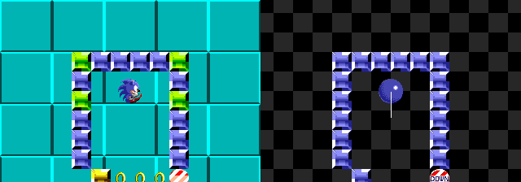

# Special Stages: Sonic 1 Rotating Maze Physics

> **Source:** [SPG:Special Stages](https://info.sonicretro.org/SPG%3ASpecial_Stages)

[← Player 2: CPU AI, Follower Physics, and Respawning](18-player-2.md) | [Index](../README.md) | [Camera: Scrolling Boundaries, Lag, and Pan Delays →](20-camera.md)

---

**Notes:**

- *The research applies to all four of the [Sega Mega Drive](https://info.sonicretro.org/Sega_Mega_Drive) games.*
- For 100% accuracy and retain the exact same movement from the original games, it is recommended you don't use degrees and rather follow the original game's 256 angle structure - though you'll have to also use the trigonometry functions from the original games. These can be found in [Calculations](02-calculations.md).

## Rotating Maze

The special stages in Sonic 1 have very unique physics, controls, and "feel". They do not share physics code with the normal gameplay at all.

### Maze Blocks

the Maze is constructed out of a grid of tiles. The size of each grid tile is *24* x *24*.
Some tiles contain solid "Blocks" (which includes normal solid blocks and special blocks such as Bumpers and Up/Down Blocks), some contain non-solid tiles like Rings, while others are empty.

### Maze Rotation

The handling of Special Stage rotation is more of an illusion than actual rotation.

While they appear to, these special stages don't actually rotate. The blocks don't even actually move at all. Instead, the Player's gravity, jump direction, and left/right input movement angle all change based on the stage's current angle. The actual Sonic object still moves relative to the static, unrotated, base layout.

So, because the Player is only ever truly colliding with flat sides of a block and not sloped angles of rotated blocks, this makes collision much easier.

##### Rotation Illusion

When Player motion and physics are processed in the Maze, it's always happening on a static un-rotated grid of the stage tiles/blocks.

While playing, the Player's gravity direction is being manipulated, and the stage is simply *displayed* as if it was rotated. When the game displays any given block, it gets rotated around Sonic (which is always centre of the screen) by the current Stage rotation angle. Thus completing the illusion.

 *How the game is actually processing the movement on the right (gravity direction shown as a white line).*

A more general way to imagine this is: Instead of the stage itself rotating, it's as if the camera and gravity direction rotates while moving across the stage.

##### Maze Speeds and Angles

The special stage starts with a rotation speed of 0.25 in the original games. (In degrees, this would be -0.3515625)

**Note**:

- *The stage_angle is always kept positive, the angle needs to be "wrapped" otherwise it will give weird results when snapping the angle when negative.*

To get the **snapped_stage_angle** (used for physics and drawing the stage), just do `(stage_angle div 4) * 4`

A rough conversion for degrees would be `floor(stage_angle / 5.625) * 5.625`

### Maze Player Object

Much of the Special stage Player object is the same as the normal Player object.

#### Variables & Constants

The Player object is like any other, it uses similar constants, and has ***X/Y Speed*** values, and a ***Ground Speed*** value. However, these values are applied differently as will be explain up ahead.

| Constant | Value |
| --- | --- |
| **acceleration_speed** | *0.046875 (12 subpixels)* |
| **deceleration_speed** | *0.25 (64 subpixels)* |
| **top_speed** | *8* |
| **gravity_force** | *0.1640625 (42 subpixels)* |

#### States

At any time the Player knows if they are touching a solid block at any side (up, down, left, right, any). This will be referred to as the "**block_hitting** flag" (true or false).

#### Player Physics

**Note**:

- All of the Player's motion that reacts to the stage's angle uses the **snapped_stage_angle** rather than **stage_angle**.

The Player is essentially always performing the same code, with only slight differences depending on the current situation.
The following will describe the different functions/routines the Player can for their physics. How and when these routines are executed will be detailed in [Player events](19-special-stages.md#1_player_events).

##### Left/Right Movement Routine

The Movement routine checks for  or  input and updates Sonic's ***Ground Speed***. Acceleration/deceleration works the same as normal, like when ***Sonic*** walks on normal ground. Friction (same as acceleration) is applied when no  or  input is detected.

After updating ***Ground Speed***, a **potential_x_speed** and **potential_y_speed** are created using Sonic's current ***Ground Speed*** and the **movement_angle**.

```c
potential_x_speed = Ground Speed * cos(movement_angle);
 potential_y_speed = Ground Speed * -sin(movement_angle);
```

###### Movement Angle

What's the **movement_angle**?
The **movement_angle** used here is not the real **stage_angle** or even the **snapped_stage_angle**. **movement_angle** is the **snapped_stage_angle** wrapped to a 90 degree slice.

 *movement_angle shown as a white line over Sonic.*

The **movement_angle** keeps to a cardinal direction of the stage, but when the stage rotates too far, it snaps back 90 degrees.

```c
movement_angle = -((snapped_stage_angle + 45) div 90) * 90;
```

This is the angle used for the Player's left/right movement, even when in the air. Because this occurs in the air too, it makes the special stage feel all the more disorienting, which is by design.

###### Checks

The game performs a [tile check](19-special-stages.md#tile_checks) at the Player's ***X Position*** + **potential_x_speed**, and the Player's ***Y Position*** + **potential_y_speed**.

If a solid block is found, ***Ground Speed*** is set to 0, otherwise, the **potential_x_speed** and **potential_y_speed** are simply directly added to the Player's ***X/Y Position***.
Neither the Player's **block_hitting** flag nor the Player's actual speeds are changed/used in this routine.

##### Fall Routine

The fall routine is where the Player's real ***X Speed*** and ***Y Speed*** come into play.

Firstly, the Player's **block_hitting** flag is reset to false.

###### Falling Speeds

Directional gravity speeds **x_gravity** and **y_gravity** are calculated based on the **snapped_stage_angle**.

```c
x_gravity = gravity_force * sin(-snapped_stage_angle);
y_gravity = gravity_force * cos(-snapped_stage_angle);
```

Then, a **potential_x_speed** and **potential_y_speed** are calculated using that new gravity:

```c
potential_x_speed = X Speed + x_gravity;
potential_y_speed = Y Speed + y_gravity;
```

###### Checks

The game then performs a [tile check](19-special-stages.md#tile_checks) at the Player's ***X Position*** + **potential_x_speed**, and the Player's ***Y Position***.

If a solid block is found, **potential_x_speed** is set to 0, and Sonic's block_hitting flag is set to true.

Then the game performs a tile check at the Player's `X Position + potential_x_speed`, and the Player's `Y Position + potential_y_speed`.

**Note**:

- *Here, **potential_x_speed** could potentially be 0 if something was found in the previous tile check.*

If a solid block is found, **potential_y_speed** is set to 0, and the Player's **block_hitting** flag is set to true.

Then, ***X Speed*** is set to **potential_x_speed**, and Y Speed is set to **potential_y_speed**.

##### Jump Routine

The jump routine simply checks if a jump button is pressed, if it is, set's the Player's ***X Speed*** and ***Y Speed*** based on the **snapped_stage_angle**, and sets the Player's block_hitting flag to false.

### Collision

Judging by the complexity presented in game, you may think collision in a rotating special stage will be extremely complicated, but it's not at all as complicated as it first appears. As previously stated, the stage doesn't *really* rotate, which simplifies things incredibly.

Collision is purely based on what tiles are nearby Sonic's position.

#### Tile Checks

Whenever a tile check occurs, it accepts an x and y position as parameters and will check the 4 closest tiles to this location. In this case, it's the Players ***X/Y Position***.

To locate the tiles to check based on this position, it will do the following

```c
check_x = (X Position - 12) div 24;
check_y = (Y Position - 12) div 24;
```

So this essentially rounds the position and gets the grid coordinates of the top left tile of what will be a 2 x 2 check area.

The game then goes through and checks the top left, top right, bottom left, and bottom right tile in that square, in that order. It will always check all 4 tiles.

**Note**:

- *No matter the stage rotation, this always happens the same way. Stage rotation is not accounted for.*
- *If any of these 4 tiles contains a solid Block, a solid Block was found and a collision will occur as stated in the physics routines previously.*

The last tile checked which had a Block in it (no matter the Stage orientation or layout of the Blocks) will become the **current_block**, and will be the one focused on for any unique reaction (if it is a Bumper for example).

#### **Reaction To Blocks**

Because of how collision is processed, the Player can only be "focused" on one block at any given time (the **current_block**), and will only react to that block. The Player will only react to the **current_block** if the block_hitting flag is currently true.

Some blocks that change the special stage state have a global *48* frame cooldown timer (per block type) so the Player can only interact with them once even if they are touching them for more than 1 frame. These include the Up/Down blocks and the R block.

##### **Up/Down Blocks**

 Up blocks double the stage rotation speed,  Down blocks divide it back.

This Block turns into the opposite type each time it activates.

Internally, Sonic 1 checks for bit 6 of the stage rotation speed to determine whether or not it should activate its effect, as this is mathematically efficient for the system. For a modern framework, a **boolean** should suffice.

##### **R Blocks**

 R blocks multiply the stage rotation speed by *-1*.

##### **Bumper Blocks**

 Bumper blocks act exactly like a normal [Bumper](13-game-objects.md#bumpers) does (aside from the fact that the initial collision condition is completely different)

The game measures the angle from the centre of the Bumper tile to Sonic's position, with a repulsion force of *7*.

### Order of events

Each frame, the special stage works in the same order:

#### 1: Player Events

Firstly, the Player's code is executed.

- If the Player's **block_hitting** flag is true, run Jump Routine.
- After this, regardless of the **block_hitting** flag state, the Player will then perform the Movement routine and lastly the Falling routine.

After the movement routines, the **current_block** will be reacted to (only when the **block_hitting** flag is true).

Then lastly, the Player's ***X Speed*** and ***Y Speed*** are added to his ***X/Y Position***.

#### 2: Other Events

After the Player's events, the game will update the **stage_angle**, by adding the rotation speed, and then calculating the **snapped_stage_angle**.

### Notes

- For 100% accuracy and retain the exact same movement from the original games, it is recommended you don't use degrees and rather follow the original game's 256 angle structure - though you'll have to also use the trigonometry functions from the original games. These can be found in [Calculations](02-calculations.md).
- As you can tell, the Player's speeds and motion are simply halted when a block is detected at his next move. The only reason he nicely smoothly falls onto surfaces and doesn't stop short is thanks to the gravity softly nestling him in each frame.

---

[← Player 2: CPU AI, Follower Physics, and Respawning](18-player-2.md) | [Index](../README.md) | [Camera: Scrolling Boundaries, Lag, and Pan Delays →](20-camera.md)
