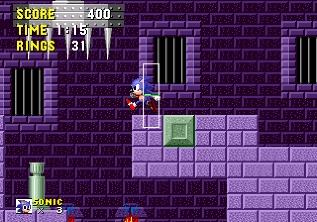
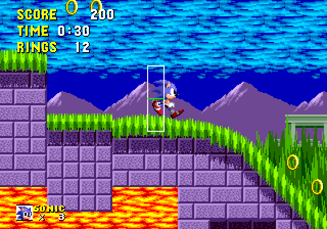

# Camera: Scrolling Boundaries, Lag, and Pan Delays

> **Source:** [SPG:Camera](https://info.sonicretro.org/SPG%3ACamera)

[← Special Stages: Sonic 1 Rotating Maze Physics](19-special-stages.md) | [Index](../README.md) | [Animations: Scripts, Variable Speed Timings, and Rules →](21-animations.md)

---

> [!NOTE]
> The original Sonic games have a screen size of **320 x 224px** during normal play.

The camera's speed is capped at **16** (**24** in S3&K) due to various limitations, lagging behind the Player if they are going too fast. ***Vertical Focus*** is used to center the camera vertically, the value is offset when looking up/downwards.

| **Borders** | **Value** |
| --- | --- |
| **Left** | *144* |
| **Right** | *160* |
| **Top** | ***Vertical Focus*** - 32 |
| **Bottom** | ***Vertical Focus*** + 32 |

| ***Vertical Focus*** | **Value** |
| --- | --- |
| **Looking Up** | *104* |
| **Center** *(Default)* | *96* |
| **Looking Down** | *88* |

| ***Tip*** |
| --- |
| The *Left/Right* borders only center the Player when they walk right. You might want to change the borders to **152** and **168** instead, to even it out a bit. |

> [!NOTE]
> In *[Sonic CD](https://info.sonicretro.org/Sonic_CD)*, the Left/Right border is always *160* until extending.

## Midair

The camera will continue to scroll towards the Player if it's above them when grounded, otherwise it's snaps if it's above. [Knuckles](https://info.sonicretro.org/Knuckles) is considered grounded when he starts to clamber over the corner of a wall, or stands up after sliding from a glide (i.e. when sliding, it still considers him to be in the air).

> [!NOTE]
> Since the player is offset by 5px when landing from a roll, it makes the camera appear as if it's moving faster. See [Solid Tiles](04-terrain-collision.md#floor_sensors_28a_and_b29) for more details.

|  |
| --- |
| A demonstration on how the **Player Y position** roams freely between the Y borders. |

## Grounded

If ***Vertical Focus*** is at its default position, and **Ground Speed** is less than 8, the speed cap will be set to **6**. otherwise it uses the regular speed cap. If ***Vertical Focus*** isn't at its default position, the speed cap is set to **2**, no matter what.

|  |
| --- |
| A demonstration on how the Player's Y position stays locked to the central Y. |

### Looking Up and Down

In *[Sonic 1](https://info.sonicretro.org/Sonic_1)*, it will immediately begin to scroll. In *[Sonic 2](https://info.sonicretro.org/Sonic_2)* onwards, the game waits **120** frames before scrolling. In *[Sonic CD](https://info.sonicretro.org/Sonic_CD)*, if / is pressed again within **16** frames, it will begin to scroll.  Unfortunately it will freeze the scrolling if you press the up or down button while the screen is already scrolling.  For instance, look up by double-tapping, let go, and then press down.  The screen will freeze, and stay there until you let go.  Even initiating a Spindash doesn't return things to normal.

## Spindash Lag

A table is used to store the position of the player in the last *32* frames. When the Spindash launches, a **Time** is set to **32** (minus the rev variable, which can be between **0** and **8** - see [Spindash](16-special-abilities.md#spindash_28sonic_22c_32c_26_k29)). **Time** decreases by **1** every frame. While **Time** is non-zero, uses the previous player position table at **Time** minus *1* until **Time** runs out.

If the camera travels 32 steps into the past, and moves based on those recorded positions for a duration of 32 steps, it would effectively just repeat them, and then switch back to the current position, hopping 32 steps back into the future.  This isn't how it works.  Since it goes back 32 steps, and waits 32 more to return to normal, that means a total of 64 recorded camera positions.  In order to take all of these positions into account during the 32 steps before the camera returns to normal, they are added together in pairs.

As an example, let's imagine the Player has been charging up their Spindash for at least 32 steps, so that they haven't moved during this time.  Then, they launch at a speed of 8.  Since in the last 32 steps he hasn't moved, the camera will move by 0 + 0 for 16 frames, remaining stationary.  Then, it will have caught up to the point in time at which the Player launched.  The Player will have been moving 8 pixels every step from this point on.  The camera will then move 16 pixels for 16 more steps until **Time** runs out.  (Technically, the Player doesn't move in the exact frame in which the Spindash launches, so the camera will move by 0 + 8 for one step, and then 8 + 8 for a while, and the 7 + 8 as friction kicks in, and then 7 + 7, and so on).

The trouble with this lag is that if you initiate and release a Spindash quickly enough after moving, the camera will actually move backward to follow where you've been.

## Flame Shield/Hyper Sonic Air Dash

The same lag routine happens as the Spindash, expect the table is blanked out with the current position, so that the camera can't scroll backward. In your engine, this could be applied for the Spindash as well, removing the backward scrolling bug.

## Extended Camera *([Sonic CD](https://info.sonicretro.org/Sonic_CD))*

When **Ground Speed** is more/equal to *6px* (or at *16* steps when charging a Spindash/Super Peel-out), the horizontal focal point is shifted back *64px* in the opposite direction the Player is facing, at a speed of *2px*.  When their ground speed drops back below *6*, it moves back to the default position.

---

[← Special Stages: Sonic 1 Rotating Maze Physics](19-special-stages.md) | [Index](../README.md) | [Animations: Scripts, Variable Speed Timings, and Rules →](21-animations.md)
